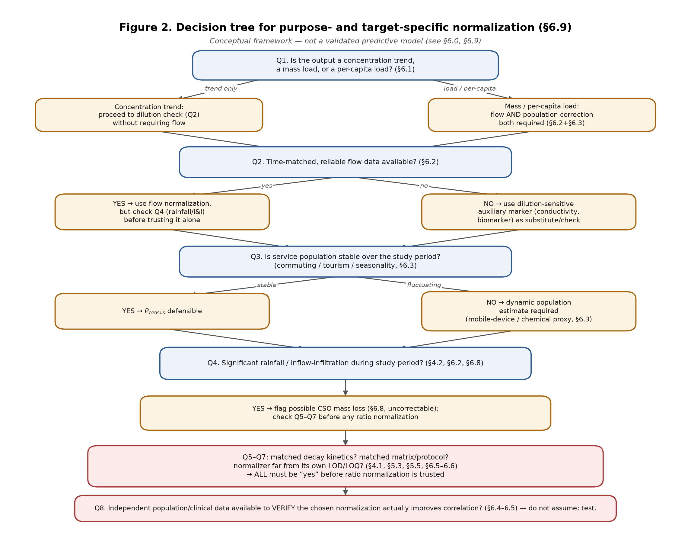
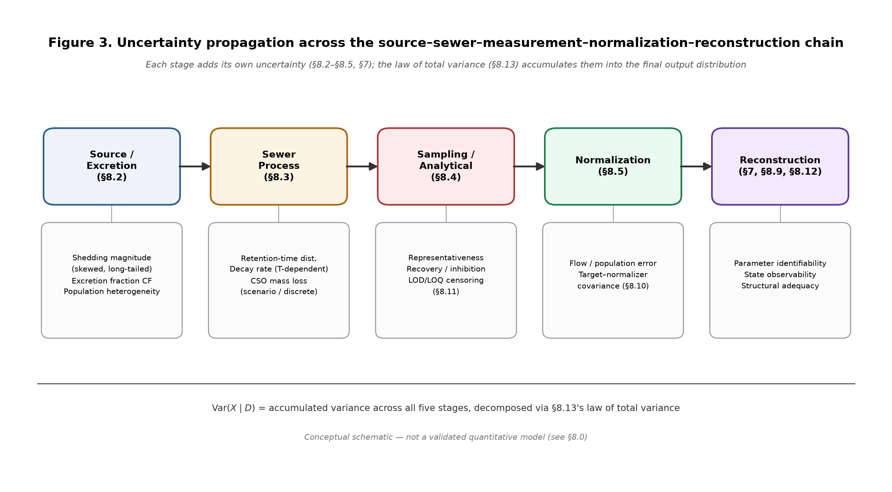
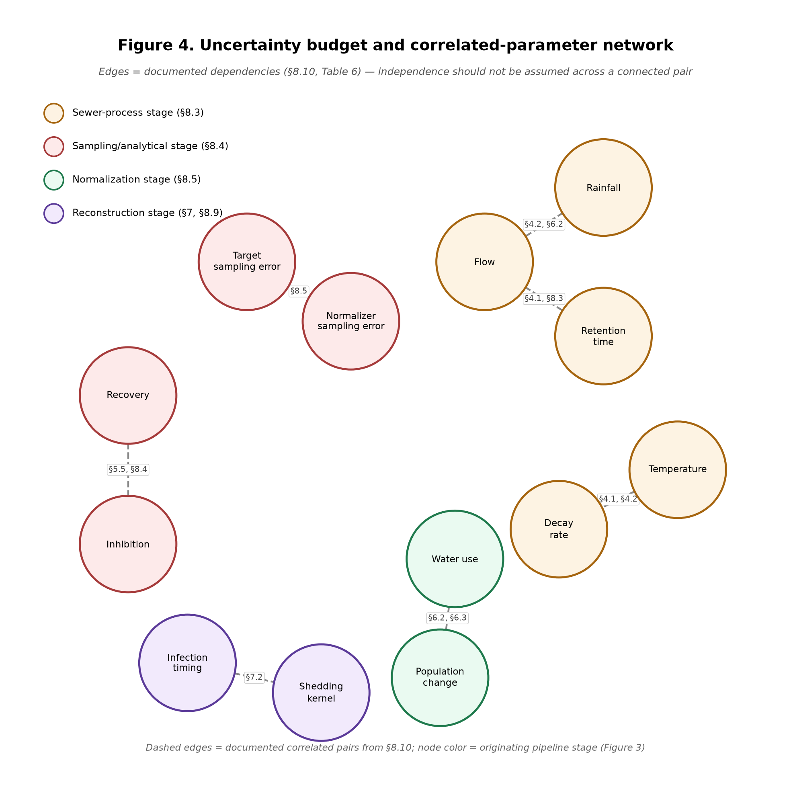

# Beyond Detection in Wastewater-Based Epidemiology: Sewer Processes, Signal Distortion, Normalization, and Epidemiological Inference

**Working draft — Chapters 1–8 (Chapter 8 added 2026-07-13: "Uncertainty propagation in wastewater-based epidemiology: from source variability to decision uncertainty")**

*Status: this is a working draft, not a submission-ready manuscript, at every chapter drafted so far — Chapter 8 is no more submission-ready than Chapters 1–7 were when first delivered. It has not undergone a systematic literature search (see §2.1–§2.2), full-text citation verification (see §2.3), peer review, or co-author sign-off. All citations were retrieved via web search this session; full-text retrieval was blocked throughout. Every quantitative claim carries an explicit verification status in the companion Citation Verification Table and should be treated as "pending full-text verification" unless that table marks it otherwise. Do not circulate, quote, or submit any part of this draft as finished work. Chapters 9–12 are not yet drafted.*

---

## 1. Introduction

Wastewater-based epidemiology (WBE) rests on a simple premise: human excreta carry a continuous, population-scale record of health and behavior, aggregated across a sewer catchment before it is ever measured. This makes wastewater monitoring attractive as a public health tool — non-invasive, requiring no individual consent or clinical encounter, and capturing asymptomatic, undiagnosed, and untested individuals alongside those who present to a clinic (National Academies of Sciences, Engineering, and Medicine [NASEM], 2023). Because sampling occurs at fixed infrastructure points rather than through individual testing, WBE is comparatively insulated from fluctuations in health-care-seeking behavior and diagnostic capacity, and can in principle be sustained continuously at a fraction of the cost of population-wide clinical testing.

These properties explain why WBE has moved, in roughly two decades, from a niche application in poliovirus eradication to a routine pillar of public health surveillance. The World Health Organization now frames wastewater and environmental surveillance (WES) as a *complementary* layer to conventional case-based surveillance, filling gaps where clinical data are sparse, delayed, or biased, rather than replacing it (WHO, 2025a). The European Commission's Wastewater Surveillance Dashboard, launched in January 2025, already aggregates a reported million-plus measurements of SARS-CoV-2, influenza, and RSV across eleven countries (European Commission, 2025 — exact figures pending full-text confirmation, see §2.3), and the recast EU Urban Wastewater Treatment Directive now requires routine wastewater surveillance and antimicrobial resistance (AMR) monitoring for large agglomerations across the Union (Eurosurveillance, 2026). China reports having built a nationwide, multi-scenario wastewater surveillance system combining national urban monitoring, inbound-flight monitoring, and pilot public-health-risk surveillance (Han et al., 2025). Wastewater surveillance is, in short, becoming institutionalized infrastructure rather than a research technique.

Institutionalization has exposed a problem the field's early, detection-oriented literature did not have to confront: **a concentration measured at a wastewater treatment plant is not, by itself, a public health indicator.** It becomes one only after a chain of physical, chemical, biological, and statistical transformations has been accounted for and, where possible, inverted. A 2024 review of population normalization markers found no consensus on which marker performs best (Boogaerts et al., 2024); a large multistate comparison found simple flow-rate normalization outperforming three commonly used fecal biomarkers in correlating with clinical COVID-19 case counts (Rainey et al., 2023); and laboratory and sewer-simulator work has shown that in-sewer microbial activity is a dominant, distance-dependent driver of viral RNA loss during transport (Jung et al., 2026). This literature marks a shift in the field's central question — from *what can be detected in wastewater?* to a harder one:

> Under what conditions does a concentration measured at a wastewater treatment plant's inlet reliably represent the true upstream excretion, infection level, consumption, or exposure of the contributing population?

**This review treats that question explicitly as an inverse problem.** A wastewater sample is an observation generated by an unknown source signal passed through a chain of physical operators — human excretion, building drainage, sewer transport, sampling, and analysis — each of which can distort the signal in one or more of three formal ways that recur throughout this review and are defined precisely in Section 3:

- **Amplitude distortion** — multiplicative or additive changes to signal magnitude (dilution, decay, recovery loss, matrix effects);
- **Temporal distortion** — shifts, lags, or smearing of the signal in time (variable shedding kinetics, sewer retention-time distributions, sampling-schedule mismatch);
- **Spatial distortion** — changes in which sub-populations and sub-catchments contribute, and in what proportion, to a single downstream composite sample (heterogeneous flow paths, combined sewer overflow, differential storm response across a network).

Recovering the source signal from a distorted, aggregated, noisy observation is only possible to the extent the problem remains **identifiable** — that is, to the extent the available data and auxiliary information constrain the space of source signals consistent with what was actually measured to a useful degree. Where identifiability is poor, **process-informed correction** — using mechanistic models of excretion, transport, and decay, rather than purely statistical normalization, to reduce the space of admissible solutions — and independent auxiliary information may narrow the admissible solution space, but they cannot guarantee identifiability or recover information irreversibly lost during transport, sampling, or aggregation (§7.0, §7.3, §8.0). These five concepts (amplitude, temporal, and spatial distortion; identifiability; process-informed correction) are introduced formally in Section 3 and used as the organizing vocabulary throughout Sections 3–8.

Three arguments organize the review as a whole:

1. The object of WBE monitoring is not the concentration of a target analyte itself, but the population-level information that concentration encodes — information recoverable only if the encoding (distortion) process is understood.
2. The signal measured at a treatment-plant inlet is the joint product of source excretion, population dynamics, in-sewer transport and transformation, and the sampling/analytical process; it cannot be treated as equivalent to source-end load without explicit, process-informed correction.
3. The field's next advance requires moving from single-target detection toward process-aware, multi-source-corrected, probabilistic inference — which in turn requires being explicit about identifiability, not just accuracy.

Section 2 describes this review's methodology and evidence base, including an honest account of its current limitations. Section 3 develops the source-to-sample signal-formation chain as a formal inverse problem. Section 4 addresses in-sewer transformation and rainfall/seasonal distortion — the review's mechanistic core — and closes by connecting distortion back to identifiability and process-informed correction. Section 5 extends the same inverse-problem framework through sampling and analytical uncertainty. Section 6 addresses normalization — flow-, population-, and biomarker-based — as a further correction step applied to the already-doubly-distorted reported signal, and argues that normalization is not itself a reconstruction of the source state but a conditionally valid statistical adjustment whose validity must be checked rather than assumed. Section 7 develops back-calculation, identifiability, and validation as a formal five-way methodological distinction, and Section 8 develops a formal uncertainty-propagation framework spanning source variability to decision uncertainty. Sections 9–12 remain to be drafted: translation to public health decisions and equity (§9), emerging multi-omics/AI directions (§10), research gaps (§11), and conclusions (§12).

---

## 2. Review Methodology and Evidence Synthesis

### 2.1 Review type and scope

This is, at the current draft stage, a **narrative synthesis structured around a mechanistic framework** (the source-to-sample signal chain and its associated inverse-problem vocabulary), not yet a formal systematic or scoping review. That distinction matters and is stated here rather than left implicit: a defensible scoping review of this literature would follow PRISMA-ScR, use structured Boolean queries against Web of Science, Scopus, and Embase, apply documented inclusion/exclusion criteria, and report a PRISMA flow diagram of records identified/screened/included. **None of that has been done yet.** What follows in §2.2–§2.3 is a transparent account of what was actually done, so the evidence base's strength can be judged accurately rather than assumed.

### 2.2 Search process used for this draft

Sources for Chapters 1–4 were identified through approximately 20 targeted queries issued to a general-purpose web search tool (not a bibliographic database), grouped around: (a) recent (2024–2026) reviews of WBE normalization, uncertainty, and methodological frameworks; (b) institutional/programmatic developments (WHO, EU, China, US CDC) from 2024–2026; (c) mechanistic literature on in-sewer transformation, RNA decay, and sewer biofilms; (d) rainfall/inflow-infiltration effects on wastewater signals; and (e) historical background on poliovirus and drug-consumption monitoring. Search results were screened for relevance by title/snippet, and priority was given to peer-reviewed journal articles, official institutional publications (WHO, European Commission, China CDC Weekly, National Academies Press), and — for a small number of background facts — reputable secondary sources (e.g., a policy-news item on WHO guidance).

This process is a reasonable way to identify a **starting evidence set** and to check that the review's mechanistic framing has real literature behind it, but it is **not equivalent to a systematic search** and almost certainly under-samples the literature, particularly older foundational work, non-English-language studies (including likely-relevant Chinese-language mechanistic and field studies), and papers that don't surface well under natural-language query phrasing. A full systematic search — using the Boolean query sets already drafted for this project (Web of Science / Scopus queries for core WBE terms, process/uncertainty terms, and emerging-contaminant terms) — is a prerequisite before this review is submission-ready, and should be run by someone with institutional database access, which was not available in this session.

### 2.3 Source verification procedure and its limitations — read before citing any number in this draft

Every citation below was checked for author list, journal, year, volume/issue, and DOI by cross-referencing at least one, and in most cases two or more, independent web-search result sets (see the companion **Citation Verification Table**). This gives reasonably high confidence in *bibliographic metadata* for most sources.

It does **not** give the same confidence in the *specific quantitative claims* attributed to those sources in the text. **WebFetch (full-text retrieval) returned HTTP 403 for every publisher domain attempted this session — PMC, MDPI, PLOS, and DOI-resolved links all failed identically** — so no source in this draft was read in full; every quantitative figure in Chapters 1–4 (percentages, rate constants, day-counts, participant/sample counts) is drawn from a search engine's auto-generated summary of the source, not from the primary text or a table therein. This is stated once here and applies uniformly, rather than being re-flagged inline after every number, but two specific issues are worth naming directly:

- **Internal inconsistency detected:** two independent searches for Miura, Kitajima, & Omori (2021) returned different point estimates for the same paper's central findings (3.4 vs. 2.6 log copies/gram-feces; 26.0-day vs. 20–32-day shedding-duration estimate). The text in §3.1 was written to avoid citing either specific number for this reason, but the discrepancy itself should be resolved by reading the primary source before this draft advances further.
- **One source considered and excluded:** a 2022 systematic review of pre-sampling factors affecting SARS-CoV-2 wastewater RNA concentrations (PMC8772136 / ScienceDirect S0048969722003813) was identified as topically relevant to §3–4 but its author list could not be confirmed with confidence across search results, so it was **not cited** rather than cited with a guessed author list.

Any number, percentage, or effect-size claim in Chapters 3–4 should be treated as **"pending full-text verification"** until someone with database/publisher access confirms it directly. This is the single most important methodological caveat in this draft.

### 2.4 Terminology and developmental background (compressed)

Three overlapping terms recur in the literature and carry different implicit inference goals: **wastewater-based epidemiology (WBE)**, generally used for work that back-calculates population-level *behavior, consumption, or exposure* from biomarker concentrations; **wastewater-based surveillance (WBS)** / **wastewater and environmental surveillance (WES)**, generally used for *trend and outbreak detection* without necessarily back-calculating absolute case counts (WHO usage; WHO, 2025a, 2025b); and the broader **environmental surveillance (ES)**, which extends to non-sewage matrices influenced by human excreta. This review uses "WBE" as the umbrella term, since the underlying signal-formation problem is shared, while preserving narrower terms where a cited study's specific inferential goal matters to the argument.

The field's growth is compressible into five overlapping phases, summarized in Table 1 rather than narrated at length: (1) poliovirus environmental surveillance, from first wastewater detection in 1939 to WHO's formal 2003 adoption within polio eradication surveillance standards; (2) illicit-drug and pharmaceutical consumption monitoring, from proposals around 1999 through demonstrated cocaine-metabolite quantification by the mid-2000s, which forced early development of quantitative back-calculation methodology; (3) COVID-19-driven expansion (2020–2022), which converted WBE from a research technique at a few dozen sites into networks covering hundreds to thousands of sewersheds (NASEM, 2023); (4) multi-pathogen, multi-purpose integration (2022–2024), extending shared monitoring infrastructure to influenza, RSV, mpox, and AMR targets; and (5) standardization, institutionalization, and probabilistic inference (2024–present) — the phase this review is positioned within, marked by formal guidance frameworks (WHO, 2025a, 2025b; Blue Community, 2025) and program-level integration (European Commission, 2025; Eurosurveillance, 2026; Han et al., 2025) alongside a methodological literature increasingly focused on normalization uncertainty and process-based correction rather than detection sensitivity per se (Boogaerts et al., 2024; Zhu et al., 2025; Rainey et al., 2023; Jung et al., 2026).

**Table 1. Developmental phases of WBE (compressed).**

| Phase | Period | Defining shift |
|---|---|---|
| 1. Poliovirus environmental surveillance | 1939–2000s | Established composite-sample detection logic; low temporal resolution, single stable target |
| 2. Drug/pharmaceutical consumption monitoring | 1999–2010s | Forced early quantitative back-calculation and correction-factor methodology |
| 3. COVID-19-driven expansion | 2020–2022 | Rapid scale-up outpaced resolution of underlying uncertainty problems |
| 4. Multi-pathogen/multi-purpose integration | 2022–2024 | Shared infrastructure extended to influenza, RSV, mpox, AMR |
| 5. Standardization & probabilistic inference | 2024–present | Institutional guidance + shift toward process-based correction and identifiability |

### 2.5 Application taxonomy, organized by inference goal

Rather than a target-by-target listing, applications are grouped here by *what kind of population-level inference is being attempted*, since the dominant distortion mechanisms differ systematically by category — a distinction used repeatedly in Sections 3–4.

**Table 2. WBE application taxonomy by inference goal.**

| Inference goal | Representative targets | Dominant distortion source |
|---|---|---|
| Infectious disease trend/outbreak detection | SARS-CoV-2, influenza A/B, RSV, poliovirus, norovirus, mpox, measles | Shedding heterogeneity (temporal); in-sewer RNA/capsid decay (amplitude) (Jung et al., 2026) |
| Antimicrobial resistance surveillance | Resistance genes/organisms, antibiotics and metabolites | One Health source attribution (spatial); indicator non-standardization (Punch et al., 2025) |
| Population behavior/consumption estimation | Illicit drugs, alcohol, nicotine, caffeine, prescription pharmaceuticals | Pharmacokinetic/excretion correction factors (amplitude); population-size normalization (spatial) (Boogaerts et al., 2024) |
| Population exposure/health-status estimation | Pesticide metabolites, plasticizers, endocrine disruptors, inflammation biomarkers | Non-human/non-dietary source contamination (amplitude); analyte transport stability (temporal) |

### 2.6 Scope boundaries

This review does not attempt to catalog every WBE target chemical or pathogen (several recent reviews already do this well — e.g., Zhu et al., 2025, on methodological frameworks; Punch et al., 2025, on AMR specifically). It is scoped instead to the signal-formation, distortion, and correction problem shared across targets, using specific pathogens/analytes as illustrations rather than as the organizing structure.

---

## 3. WBE as an Inverse Problem: Source-to-Sample Signal Formation

### 3.0 Formal problem statement

Every WBE inference implicitly assumes a chain connecting a population-level event to a measured concentration:

**population infection, consumption, or exposure → human uptake, metabolism, and excretion → household/building drainage → sewer conveyance → pump stations, storage, and overflow structures → treatment-plant inlet sampling → sample preservation and pre-treatment → instrumental analysis → normalization → load or trend back-calculation → public health interpretation.**

It is useful to state this chain formally, at least schematically, because doing so makes precise what "signal distortion" means and why some correction strategies work while others cannot. Let $X(\tau)$ denote the true source-end excretion signal (mass of target analyte entering the network per unit time from the contributing population, as a function of source time $\tau$). The observed concentration $Y(t)$ at the treatment-plant inlet at sampling time $t$ can be written schematically as

$$Y(t) \;\approx\; A(t)\,\left[\, K(t,\tau) \ast X(\tau) \,\right] \;+\; \varepsilon(t)$$

where $K(t,\tau)$ is a transport kernel describing how much of the mass excreted at source time $\tau$ arrives at the sampling point at time $t$ (this kernel is not a fixed delay but a *distribution* over arrival times, because different sub-catchments and flow paths have different retention times); $A(t)$ is a multiplicative amplitude factor capturing dilution, in-transit decay, and recovery/matrix effects; and $\varepsilon(t)$ is measurement noise. Three named distortion types follow directly from this structure and are used throughout the remainder of this review:

- **Amplitude distortion** is any process that scales $A(t)$ away from 1 in a way not accounted for — dilution from inflow/infiltration, in-sewer decay, adsorption losses, and analytical recovery inefficiency all act on $A(t)$.
- **Temporal distortion** is any process that broadens, shifts, or otherwise reshapes the kernel $K(t,\tau)$ away from a simple, known, fixed delay — variable individual shedding kinetics broaden the *effective source pulse* $X(\tau)$ itself, while heterogeneous sewer retention times broaden $K$; both have the practical effect of smearing a sharp underlying epidemiological signal (e.g., an outbreak onset) into a slower, delayed, harder-to-localize rise in $Y(t)$.
- **Spatial distortion** arises because a single treatment-plant sample is, in reality, a sum of contributions from multiple sub-catchments $i$, each with its own $K_i$, $A_i$, and even its own $X_i$ (e.g., an institutional sub-catchment with atypical excretion patterns) — that is, $Y(t)$ is really $\sum_i A_i(t)\,[K_i \ast X_i](t)$, a weighted sum across sub-catchments rather than a single clean chain. Spatial distortion is what happens when the *relative weighting* of the $i$ sub-catchments in that sum changes over time — for instance, when a storm disproportionately increases the flow contribution from one sub-catchment relative to others.

**Identifiability** is the question of whether $Y(t)$, plus whatever auxiliary data are available (flow, temperature, population markers, rainfall records), constrains $X(\tau)$ — or the population-level quantity of interest derived from it — to a useful degree, given that $A(t)$, $K(t,\tau)$, and the sub-catchment weighting are all simultaneously uncertain. When they are unconstrained, many different combinations of true source signal and distortion process are consistent with the same observed $Y(t)$, and back-calculation is correspondingly non-unique — the review returns to this explicitly in §4.3. **Process-informed correction** is the practice of using independently measured or mechanistically modeled information about $A(t)$ and $K(t,\tau)$ (flow data, temperature-dependent decay kinetics, retention-time distributions from hydraulic models) to narrow that solution space, as opposed to correcting purely empirically (e.g., fitting a single population-marker ratio across an entire monitoring period regardless of conditions).

This section (§3.1–§3.2) and Section 4 work through what actually drives $X(\tau)$'s deviation from a simple proportional signal, and what actually shapes $A(t)$ and $K(t,\tau)$, in roughly the order they occur along the chain above.

### 3.1 Source-End Biological and Behavioral Variation

The starting assumption that a given number of infected, medicated, or exposed individuals produces a proportional, predictable mass of target analyte — i.e., that $X(\tau)$ is a simple scaled copy of the epidemiological quantity of interest — is only approximately true, and breaks down differently for different target classes. This is a source of **temporal distortion** (through shedding-kinetics-driven broadening of the effective source pulse) and, secondarily, **amplitude distortion** (through population-average shedding-intensity uncertainty).

**Shedding heterogeneity (temporal distortion).** For SARS-CoV-2, fecal RNA shedding is neither universal nor uniform across infected individuals, and where it occurs, concentration and duration both vary substantially, with shedding continuing well beyond the period of respiratory symptoms in some individuals (Miura, Kitajima, & Omori, 2021 — see §2.3 for a flagged inconsistency in this source's precise point estimates). Because shedding intensity is not constant across the course of infection, the same number of currently-infected individuals in a catchment can correspond to different total fecal viral loads on different days depending on the mix of early-, peak-, and late-stage infections present — this broadens the effective source pulse $X(\tau)$ relative to the sharper underlying infection-incidence curve, which is precisely a temporal distortion in the formal sense defined in §3.0, and one that a single point-in-time correlational model cannot remove without an explicit epidemic-phase or shedding-kinetics term.

**Asymptomatic and undiagnosed shedding (identifiability, not distortion per se).** Because WBE captures shedding regardless of symptom status or care-seeking behavior, catchment-level signal includes a contribution from asymptomatic and subclinical infections that clinical surveillance systematically misses — WBE's core comparative advantage (NASEM, 2023). This is not a distortion of $X(\tau)$ relative to true population infection burden so much as a difference in *what quantity* $X(\tau)$ actually tracks relative to the clinical case count; treating wastewater and clinical signals as measuring the same denominator, when they structurally do not, is itself an identifiability problem.

**Dose, formulation, and route for chemical targets (amplitude distortion).** For pharmaceuticals and illicit drugs, excreted mass depends on administered dose, route of administration, individual metabolic rate, and the ratio of parent compound to metabolites excreted — a ratio that varies with liver and kidney function, age, and co-administered substances. Back-calculation models require a population-average pharmacokinetic correction factor, and because that factor is typically derived from clinical pharmacokinetic studies in smaller, more homogeneous populations than the sewershed being monitored, it is a source of systematic amplitude error in consumption estimates, not merely random noise (Boogaerts et al., 2024).

**Diurnal and weekly excretion cycles (temporal distortion).** Toilet-flushing behavior, meal timing, and occupational schedules produce pronounced diurnal and day-of-week cycles in both flow and analyte loading, so grab samples taken at different times of day, or composites started at different clock times, are not directly comparable even within the same catchment — a source of temporal distortion whose practical consequence is discussed further in the sampling design content planned for §5.

### 3.2 Building and Local Drainage Processes

Between excretion and the public sewer lies building plumbing — a stage largely absent from the WBE uncertainty literature despite being the point closest to the source, and therefore, in principle, the stage where distortion is most tractable to characterize and correct.

Relevant factors, mapped to the §3.0 taxonomy, include: per-fixture flush volumes and building water-use efficiency, which set an initial dilution ratio (**amplitude**) applied before excreta reaches any public sewer; mixing with greywater from bathing, laundry, and food preparation (**amplitude**); the disproportionate contribution of institutional sources — hospitals, schools, elder-care facilities, airports, and prisons — whose occupant excretion patterns, drug and disinfectant use, and occupancy dynamics differ systematically from residential norms and can locally dominate a sub-catchment's signal (**spatial**, in the sense of §3.0's sub-catchment-weighting formulation); the use of disinfectants and cleaning chemicals that may inhibit downstream molecular assays or alter chemical target stability (**amplitude**); and finite in-building retention time, during which limited but non-zero transformation can begin before wastewater reaches the public network (**temporal**, a small additional broadening of $K$). Because building- and sub-catchment-scale monitoring is a rapidly growing application for outbreak localization in institutional settings, understanding building-level distortion is increasingly a monitoring-design question in its own right, not only a theoretical caveat.

---

## 4. Signal Distortion in Sewer Transport: From Transformation to Identifiability

Section 3 established that source-end signal is already heterogeneous — subject to temporal and amplitude distortion — before it enters the public network. This section argues that the sewer network itself is not a passive conduit but an active reactor, and that rainfall in particular is not simply a nuisance confound but a structural perturbation that acts on amplitude, temporal, and spatial distortion simultaneously. Section 4.3 then closes the loop back to the §3.0 framework by discussing what these combined distortions imply for identifiability and why process-informed correction, rather than purely empirical normalization, is the appropriate response.

### 4.1 Physical, Chemical, and Biological Transformation in Transit — Amplitude and Temporal Effects

**Physical processes (amplitude and temporal).** Sewage in transit is subject to dilution from base infiltration (amplitude), particle adsorption and desorption governing the liquid/solid partitioning of a target (amplitude, and indirectly temporal if particle-bound fractions settle and later resuspend), sedimentation and resuspension of settled solids, gas–liquid partitioning for volatile compounds, incomplete mixing across converging sub-catchment flows (spatial), and — critically — different hydraulic retention times along different tributary paths converging at one downstream sampling point (temporal, formally the kernel $K_i$ varying by sub-catchment $i$ introduced in §3.0). A single treatment-plant sample is therefore a time- and path-weighted composite whose weighting is rarely known explicitly.

**Chemical processes (amplitude).** Hydrolysis, redox reactions, pH- and ionic-strength-dependent speciation, and binding to dissolved organic matter can alter a chemical target's measurable concentration independent of any change in the mass originally excreted. Photolysis is generally negligible in closed sewers but can matter in open channels or exposed storage structures.

**Biological processes (amplitude, with temporal implications).** Sewer biofilms — microbial layers coating pipe walls — are an active sink for viral RNA rather than an inert surface: laboratory reactor studies reported roughly 90% reduction in SARS-CoV-2 RNA concentration within two hours of exposure to biofilm-colonized gravity and rising-main sewer reactors (Zhang et al., 2023; figure pending full-text confirmation, see §2.3). A 2026 study combining batch decay tests with a lab-scale sewer pipeline simulator found microbial activity, rather than chemical hydrolysis, to be the dominant driver of RNA loss, with decay increasing measurably as a function of transport distance and first-order decay constants reported several-fold higher in raw wastewater than under microbially suppressed conditions (Jung et al., 2026; specific rate constants pending full-text confirmation). Because decay is distance- (and therefore retention-time-) dependent, amplitude loss and temporal distortion are not independent here: sub-catchments with longer retention times lose proportionally more signal, which means amplitude loss is itself spatially heterogeneous across a network — a coupling that purely multiplicative "flow normalization" cannot, by construction, correct for.

**Network-level controls.** The rate and extent of transformation are jointly governed by wastewater temperature, dissolved oxygen and redox conditions, pH, hydraulic retention time, pipe diameter and slope (setting flow velocity and hence both retention time and shear-driven resuspension), sediment accumulation, combined-vs-separated network design, and pump-station/storage operation — meaning two sewersheds with identical source-end populations can produce measurably different treatment-plant signals purely from network geometry and operation.

### 4.2 Rainfall- and Warm-Season-Induced Distortion — A Compound Perturbation

**Direct effects of rainfall (amplitude + temporal + spatial, simultaneously).** Rainfall enters sewer networks through two structurally different pathways with distinct signatures: *inflow* (fast, direct stormwater entry through manholes and connected drains) and *infiltration* (slower groundwater intrusion through pipe joints and cracks), together inflow and infiltration (I&I). Both dilute measured concentrations (**amplitude**), but I&I additionally increases total flow, can resuspend settled sediment — transiently spiking rather than only diluting particle-bound targets (**amplitude**, non-monotonic) — shortens effective hydraulic retention time by increasing flow velocity (**temporal**), and shifts the relative contribution of different sub-catchments to the composite signal as flow paths normally minor become proportionally larger during storms (**spatial**, i.e., the sub-catchment weights $A_i, K_i$ in §3.0's summation shift together). In combined sewer systems, sustained rainfall can trigger combined sewer overflows (CSOs), which vent wastewater directly to the environment before it reaches the sampling point — a loss pathway that depresses measured downstream concentration and flow simultaneously, which can *cap* the flow signal in a way that masks, rather than merely dilutes, the true degree of disturbance. Comparative work in rural sewersheds found that under substantial I&I, several standard normalization approaches — including simple flow normalization — become unreliable (Darling et al., 2025). Storm timing frequently does not align with routine sampling schedules, so scheduled composite or grab samples may miss the peak dilution/resuspension event, or capture only its tail. A large Belgian national wastewater surveillance program (5 million inhabitants, 42 treatment plants, 15 months across three epidemic waves) reported that explicitly correcting SARS-CoV-2 concentration data for rainfall impact substantially improved correlation with clinical case counts relative to uncorrected data, and that uncorrected rainy-period data systematically *underestimated* the indicator (Janssens et al., 2022) — direct evidence that rainfall behaves as a correctable, structured bias rather than unstructured noise, which is exactly the process-informed-correction argument developed in §4.3.

**Warm-season effects (amplitude, and indirectly temporal via biofilm activity).** Elevated temperature independently accelerates degradation of most biological targets — coronavirus RNA decay accelerates markedly above roughly 26 °C in wastewater matrices (Guo et al., 2023; threshold pending full-text confirmation) — while also increasing sewer biofilm metabolic activity and hence biofilm-mediated RNA loss (Jung et al., 2026; Zhang et al., 2023), shifting adsorption–desorption equilibria for particle-associated targets, and changing baseline human behavior in ways that affect both water use (dilution) and the underlying epidemiology or consumption patterns being monitored. Because rainfall in many climates is seasonally correlated with temperature (e.g., warm-season convective storms in monsoon-influenced or subtropical regions), the two distortion mechanisms frequently co-occur and can be difficult to separate empirically without a mechanistic transport-and-decay model — itself an argument for process-informed rather than purely statistical correction.

### 4.3 Identifiability and the Case for Process-Informed Correction

Sections 4.1–4.2 establish that amplitude, temporal, and spatial distortion are not independent nuisance factors that can be corrected one at a time with a single ratio (a population marker, a flow term). They are coupled — retention time affects decay, decay is spatially heterogeneous, rainfall shifts retention time and sub-catchment weighting simultaneously — which is precisely the condition under which an inverse problem becomes **poorly identified**: many different combinations of true source signal $X(\tau)$, decay/dilution history $A(t)$, and sub-catchment weighting are consistent with the same single observed time series $Y(t)$, especially when $Y(t)$ is sampled at low frequency (e.g., weekly grab samples) relative to how quickly these processes change (hours to days for a storm event).

Two practical implications follow directly, and both point toward the same conclusion:

1. **Empirical normalization using a single fixed ratio (a constant population marker or a static per-capita flow assumption) cannot restore identifiability under these conditions**, because it implicitly assumes $A(t)$ and $K(t,\tau)$ are constant, or vary only with flow, when the evidence in §4.1–4.2 shows they vary with temperature, retention time, and storm state as well. This is consistent with the empirical finding that flow normalization alone outperforms fecal-biomarker normalization in some settings (Rainey et al., 2023) but becomes unreliable under high I&I in others (Darling et al., 2025) — the two findings are not in tension once read as evidence that *no single fixed correction factor is identifiable across all hydraulic conditions*.
2. **Process-informed correction — explicitly modeling $A(t)$ as a function of measured temperature, flow, and rainfall, and $K(t,\tau)$ as a function of measured or estimated retention-time distribution — is what narrows the solution space back down to something usable**, as demonstrated in the one case in this evidence base where a mechanistic rainfall correction was directly tested against an alternative (Janssens et al., 2022, improved correlation after explicit rain correction relative to uncorrected data).

This is the throughline the remainder of this review develops in quantitative terms: normalization (§6) and back-calculation (§7) methods should be evaluated not just on correlation with clinical outcomes, but on whether they use enough process information to make the underlying inverse problem identifiable under the range of hydraulic and seasonal conditions a given monitoring program will actually encounter — and §8's uncertainty-propagation framework (not yet drafted) is, in effect, a way of quantifying how much identifiability is lost or preserved at each stage of the chain in §3.0. §6.6 develops this argument concretely for ratio normalization; §7.3 develops the same argument again, in its strongest form, for back-calculation specifically, distinguishing association/correlation from predictive performance from parameter identifiability (structural and practical) from state observability from model structural adequacy.

---

## 5. Sampling, Analytical Methods, and Quality Assurance: A Second Round of Distortion

### 5.0 Bridge from Chapters 1–4, Notation, and Two Observation Models

Chapters 3–4 treated the sewer network as the source of distortion between excretion and the treatment-plant inlet, described formally in §3.0 as amplitude distortion $A(t)$ and a retention-time kernel $K(t,\tau)$ acting on a source signal $X(\tau)$. This chapter argues that **the sampling and analytical process is a second, independent stage of distortion acting on top of, not instead of, the first** — everything in §3–4 already happened to the sewage by the time a sample bottle is filled; §5 is about what happens to the signal *after* that point, on the way to becoming a number in a spreadsheet.

**Notation note.** An earlier draft of this section used $R$ for analytical recovery. That symbol is reserved in this review for rainfall disturbance — introduced narratively in §4.2 and intended to receive a formal symbol, $R(t)$, once normalization and back-calculation are formalized in §6–§7 — so reusing it here for recovery would create a direct conflict once §6 is drafted. This section uses $\eta_{rec}$ (recovery), $\eta_{inh}$ (inhibition), and $B(t)$ (batch effect) instead; $R(t)$ is not used anywhere in this chapter and remains available for rainfall in later chapters.

**Two observation models, not one.** An earlier draft of this section used a single equation to describe how recovery, inhibition, and batch effects distort the reported value $\hat{Y}(t)$ relative to the true in-network concentration $Y(t)$, applying it uniformly to pathogens, ARGs, and chemical markers alike. That was a mistake worth naming explicitly: **PCR (or equivalent amplification-chain) inhibition is a phenomenon specific to nucleic-acid detection and has no analog in mass-spectrometry-based chemical analysis, while ion suppression/enhancement and isotope-dilution recovery correction are specific to chemical analysis and have no analog in a PCR-based assay.** Collapsing both into one term hides exactly the kind of target-class-specific distortion that §5.6 goes on to argue matters. Two separate observation models are used instead:

**Molecular-target observation model** (pathogens and ARGs — both detected via nucleic-acid amplification or sequencing, per §5.6):

$$\hat{Y}_{mol}(t) \;=\; \frac{\eta_{rec}(t) \cdot Y(t)}{1 + \eta_{inh}(t)} \cdot B_{mol}(t) \;+\; \nu_{mol}(t)$$

where $\eta_{rec}(t)$ is nucleic-acid extraction/concentration recovery efficiency (fraction of true target mass surviving concentration and extraction — an **amplitude** term, §5.4–5.5), $\eta_{inh}(t)$ is the degree of PCR/amplification inhibition from co-extracted matrix compounds (a second, independent **amplitude** term, §5.5), $B_{mol}(t)$ is the molecular-assay batch/method effect (primer-probe set, qPCR-vs-dPCR-vs-sequencing platform choice, processing date/laboratory — a **temporal** distortion when it varies by batch rather than by true signal, §5.5), and $\nu_{mol}(t)$ is molecular measurement noise, which is not a simple additive constant but is itself concentration-dependent (Poisson counting noise near the detection limit for digital PCR, Ct-value noise for real-time PCR) — see §5.5's discussion of precision vs. sensitivity for why this matters.

**Chemical-biomarker observation model** (pharmaceuticals, illicit drugs, and metabolites — detected via liquid chromatography–mass spectrometry, per §5.6):

$$\hat{Y}_{chem}(t) \;=\; \eta_{ext}(t) \cdot \eta_{ion}(t) \cdot Y(t) \cdot B_{chem}(t) \;+\; \nu_{chem}(t)$$

where $\eta_{ext}(t)$ is extraction/solid-phase-extraction recovery efficiency (an **amplitude** term, typically corrected using an isotope-labeled internal standard rather than a biological process-control spike), $\eta_{ion}(t)$ is the ionization-efficiency term capturing matrix-dependent ion suppression or enhancement during mass-spectrometric detection — the chemical-analysis analog of, but mechanistically unrelated to, PCR inhibition (a separate **amplitude** term, §5.5), $B_{chem}(t)$ is instrument/batch effect (LC column performance drift, calibration-curve batch — a **temporal** distortion, §5.5), and $\nu_{chem}(t)$ is chemical measurement noise, generally closer to constant-variance behavior than $\nu_{mol}(t)$ across the quantifiable range, though it too degrades near the assay's limit of quantification.

**These are conceptual observation models, not parameter-validated quantitative models.** Like the schematic equation in §3.0, they are organizing devices for reasoning about *which* distortion terms apply to *which* target class and *why* — none of the $\eta$, $B$, or $\nu$ terms above has been fit to data or validated against an independent dataset in this review; no functional form (linear, multiplicative, or otherwise) should be assumed correct without independent verification. Their purpose is to make explicit, by construction, that a molecular-target inhibition correction and a chemical ion-suppression correction are not interchangeable and should not be reported under a single generic "recovery-corrected" or "matrix-corrected" label without specifying which model and which terms were actually applied.

Sampling location and sampling mode (§5.1–5.2) sit upstream of both models and determine *which* $Y(t)$ is even being estimated, regardless of target class — a grab sample estimates $Y$ at a single instant, a composite estimates a time-weighted or flow-weighted average of $Y$ over the collection interval, and different sub-network sampling points estimate different sub-catchment-weighted sums, reintroducing the **spatial distortion** term from §3.0 at the sampling-design level rather than the network-transport level. Sections 5.1–5.6 work through each of these terms in turn; §5.7 closes the loop by classifying them into systematic bias, random error, and information loss, and connecting each explicitly to normalization (§6), back-calculation (§7), and uncertainty propagation (§8).

### 5.1 Sampling Location — A Further Spatial-Distortion and Identifiability Choice

Location and mode (§5.1–5.2) together determine what this review calls **sampling representativeness**: how well the specific instant(s), volume(s), and network point(s) actually sampled represent the quantity a study intends to estimate (a daily mass load, an instantaneous concentration, a weekly trend). Representativeness is a property of the sampling design itself, evaluated before any recovery correction, PCR/ionization step, or statistical analysis is applied — a perfectly recovered, perfectly precise measurement of an unrepresentative sample is still a biased estimate of the target quantity, which is why representativeness is kept conceptually distinct from analytical recovery and measurement precision throughout §5.4–5.5 rather than folded into a single "uncertainty" label.

Where a sample is taken determines which sub-catchment-weighted sum (§3.0) is actually being observed, trading spatial resolution against population coverage and signal stability:

- **Treatment-plant inlet.** Captures the full catchment population, giving the most stable, lowest-variance signal, but aggregates all upstream sub-catchments into one composite — the point of maximum spatial distortion in the sense that individual sub-population or outbreak-location information is irretrievably mixed, though the point of minimum sampling-logistics burden.
- **Mid-network nodes / manholes.** Trade population coverage for spatial resolution — useful for localizing an outbreak to a neighborhood or facility, but each node covers a smaller, more volatile population, so grab-sample and short-term-composite noise (§5.2) becomes proportionally larger relative to true signal.
- **Pump stations.** Convenient access points that also aggregate multiple sub-catchments, similar in spatial-averaging character to treatment-plant inlets but at an intermediate scale, and subject to additional turbulent mixing and, in wet-weather conditions, wet-well storage effects not present at a simple gravity-flow node.
- **Building-scale sampling.** Maximizes spatial resolution (down to a single facility) and is increasingly used for institutional outbreak surveillance, but signal is dominated by the occupancy-specific source-end variation discussed in §3.2, and population size can be small enough that individual-level shedding heterogeneity (§3.1) — rather than network transport — becomes the dominant source of sample-to-sample variability.

The choice of sampling location is therefore not merely logistical; it is a decision about which point in the §3.0 spatial-aggregation hierarchy the resulting data can speak to, and downstream normalization/back-calculation choices (§6–7) need to match that scale rather than treat all sampling locations as interchangeable inputs to the same model.

### 5.2 Sampling Mode — Amplitude and Temporal Distortion at the Point of Collection

Four sampling modes recur in the literature, and they differ in how they distort $Y(t)$ even before recovery or analytical effects (§5.4–5.5) are considered:

- **Grab sampling** captures $Y$ at a single instant and is therefore maximally exposed to the diurnal/weekly temporal distortion described in §3.1 — a grab sample taken during a low-flow, low-excretion period of the day can differ from one taken during a peak period by more than any true day-to-day epidemiological change, i.e., it is the sampling mode with the weakest representativeness in the §5.1 sense. A preprint survey aggregating prior sampling-uncertainty studies reports grab sampling as contributing materially higher representativeness-related uncertainty than continuous flow-proportional sampling (Chen et al., 2024, arXiv preprint). **This review does not repeat the survey's specific percentage figures in the main text**, because the survey itself does not fully attribute them to an identifiable primary study — they are two levels removed from the original data. The specific numbers are retained in the companion Citation Verification Table under "pending full-text verification" rather than presented here as an established field-wide constant; the qualitative ranking (grab worse than flow-proportional composite for representativeness) is the claim this review actually relies on.
- **Time-proportional composite sampling** collects fixed-volume aliquots at fixed time intervals over a collection period (commonly 24 hours), reducing single-instant temporal distortion relative to grab sampling but still weighting low-flow and high-flow periods equally, which biases the composite relative to a true flow-weighted daily mass load.
- **Flow-proportional composite sampling** collects aliquots proportional to instantaneous flow, more directly approximating the mass-weighted daily average and generally regarded as the reference-standard approach for load estimation; it requires continuous flow monitoring, which is itself a data stream subject to error (see §4.2's discussion of flow-measurement problems during storm-driven combined sewer overflow).
- **Passive sampling** (e.g., Moore swabs or other sorptive media left in the flow for a fixed deployment period) integrates signal continuously without requiring powered auto-sampling equipment, and comparative work has found passive samplers performing similarly to automatic composite sampling — and outperforming grab sampling — for SARS-CoV-2 detection in small-community manhole settings, with high (though not perfect) agreement against composite sampling in a parallel-deployment university-campus comparison (Cha et al., 2023). Because passive samplers integrate mass adsorbed over the deployment window rather than measuring a concentration directly, converting their signal to a comparable concentration or load estimate requires an additional, separately uncertain adsorption-kinetics correction step — an additional term effectively folded into $\eta_{rec}$ or $\eta_{ext}$ in the §5.0 observation models depending on target class, and one that is less standardized across studies than composite-sampler recovery.

No single mode dominates on every criterion: flow-proportional composite sampling is generally best for quantitative load/back-calculation applications precisely because it most directly targets the mass-weighted average the inverse problem in §3.0 is trying to recover, while passive and grab sampling trade quantitative comparability for deployment simplicity and are more defensible for qualitative trend/detection applications (in the §2.5 taxonomy's terms) than for consumption or exposure back-calculation.

### 5.3 Sample Matrix — Liquid, Particulate, Settled Solids, and Sludge

A target analyte's partitioning between the liquid and solid phases of wastewater is not a fixed property of the analyte alone; it is context-dependent, and — importantly for cross-study comparability — **studies disagree substantially even for the same analyte class**. Multiple studies report SARS-CoV-2 RNA strongly enriched in the solids fraction: settled-solids concentrations reported on the order of 10³–10⁴ times higher per unit mass than liquid influent, with primary settled solids enriched by roughly three orders of magnitude relative to liquid wastewater at some treatment works (Kim et al., 2022; figures pending full-text confirmation). Other studies, by contrast, have reported near-even partitioning between liquid and solid fractions after centrifugation, or even a majority of RNA in the liquid phase, depending on centrifugation speed/duration, solids content, and other matrix-specific conditions. This is not merely conflicting data to be averaged away — it is direct evidence that liquid-vs-solid partitioning is itself an additional, poorly standardized amplitude-distortion term (in the §5.0 sense) that differs across treatment works, sampling protocols, and even processing steps applied to the same physical sample, and that comparing a concentration measured in liquid influent at one site against a concentration measured in settled solids at another, without an explicit partitioning correction, is not a valid like-for-like comparison.

Sludge (further downstream, post-primary-treatment) shows still higher enrichment — primary settled sludge concentrations reported roughly 100- to 1,000-fold higher than influent (pending full-text confirmation) — which makes sludge-based monitoring attractive for sensitivity in low-prevalence settings but compounds the cross-matrix comparability problem further, since sludge composition is also shaped by treatment-plant-specific processes (primary clarification efficiency, retention time in the clarifier) that add yet another site-specific, generally uncharacterized correction term.

### 5.4 Preservation, Pre-Treatment, Concentration, and Extraction

Once collected, a sample continues to change before it is ever measured. Storage temperature and freeze-thaw handling are now reasonably well characterized as a major, controllable source of amplitude distortion for RNA targets specifically: comparative work found SARS-CoV-2 RNA recovery significantly greater when raw samples were stored at 4 °C rather than frozen, with freeze-thaw cycling degrading both raw-sample recovery and downstream sequencing quality, and gene-target-specific sensitivity to freezing (the SARS-CoV-2 S gene reported more freeze-thaw-sensitive than the E or N gene targets in the same sample) — meaning that which specific gene target an assay reports can itself partly determine how much cold-chain-handling distortion is present (Williams et al., 2024; specific recovery differentials pending full-text confirmation). The same body of work reports short-term stability sufficient for practical transport (on the order of days at 4 °C or ambient temperature) but degradation beyond that window, and — separately — good long-term stability of already-extracted nucleic acid stored at −80 °C over many months, which has direct implications for retrospective/biobanked-sample studies (including any attempt to re-analyze archived samples for a target not originally assayed).

Concentration and extraction method choices (PEG precipitation, ultrafiltration, aluminum-salt precipitation, direct-capture/affinity methods, and others) each have method-specific recovery efficiencies — the $\eta_{rec}(t)$ term in §5.0's molecular-target model, or $\eta_{ext}(t)$ in the chemical-biomarker model — that are neither uniform across target classes nor stable across matrices, which is precisely why recovery correction (spiking a known quantity of a surrogate/process-control organism for molecular targets, or an isotope-labeled internal standard for chemical targets, and back-calculating true recovery) has become standard practice rather than an optional refinement; without it, method choice alone can account for a large share of between-study variability, as discussed further in §5.5.

### 5.5 Six Concepts That Should Not Be Collapsed Into One "Uncertainty"

An earlier draft of this section discussed recovery, inhibition, detection limits, and between-laboratory variability as though they were facets of one undifferentiated "uncertainty." They are not, and treating them as interchangeable is itself a source of error — a low-recovery/high-precision method and a high-recovery/low-precision method fail in different ways and need different fixes. Six concepts are distinguished here and used consistently for the remainder of this review:

- **Sampling representativeness** (defined in §5.1) — whether the sample collected actually represents the intended target quantity. A property of sampling design, prior to and independent of anything discussed below.
- **Analytical recovery** ($\eta_{rec}$ / $\eta_{ext}$ in §5.0) — the fraction of true target mass that survives concentration and extraction to reach the detection step. A recovery problem is fundamentally an *amplitude-loss* problem: it scales the signal down (or, rarely, up via concentration artifacts) but does not necessarily make repeated measurements of the same extract inconsistent with each other.
- **Measurement precision** — the repeatability of the analytical result across replicate measurements of the *same* processed sample/extract. A method can have poor recovery but excellent precision (consistently measuring 40% of true mass every time), or good recovery but poor precision (averaging close to true mass but varying widely run to run) — these require different corrections (a fixed recovery-correction factor vs. averaging more replicates or improving assay chemistry) and should not be reported as a single combined "error bar" without specifying which one dominates.
- **Analytical sensitivity** — the assay's inherent ability to distinguish a true positive signal from background at low concentrations, governed by detection chemistry (primer/probe design, ionization efficiency, instrument noise floor) rather than by what happened to the sample upstream. Two assays with identical recovery can have very different sensitivity.
- **Censoring below LOD/LOQ** — the statistical-reporting consequence of low sensitivity and/or low true concentration: values below the limit of detection/quantification are not "zero," they are censored observations, and how they are handled (dropped, substituted with a fixed fraction of the LOD, or modeled explicitly with censored-data methods such as Tobit or maximum-likelihood approaches) materially changes any downstream trend estimate — this is a data-analysis decision layered on top of, not identical to, sensitivity itself.
- **Biological and technical replicates** — technical replicates (repeated analysis of the *same* extract) isolate analytical-stage variance (precision, in the sense above); biological replicates (independent samples collected from the same nominal population/time window) additionally capture true sampling representativeness variance (§5.1) plus any real biological heterogeneity in the source signal (§3.1). A study that reports only technical replicate variance is silently assuming sampling representativeness is perfect — an assumption §5.1–5.2 gives no grounds for making.

**Recovery and inhibition, specifically, for molecular targets.** Even after concentration and extraction, two largely independent amplitude-distortion mechanisms remain before a molecular-target number is produced: incomplete recovery of the true target mass ($\eta_{rec}$), and inhibition of the PCR (or equivalent) detection chemistry itself by co-extracted wastewater matrix compounds ($\eta_{inh}$). These are mechanistically distinct — a sample can have excellent recovery and still be strongly inhibited, or vice versa — which is why recovery-control spikes and inhibition controls (e.g., diluting the extract, or amending with an inhibitor-tolerant enzyme/protein such as gp32) are run as separate quality-control checks in a well-designed protocol. Wastewater is understood to contain a variable, matrix- and catchment-specific cocktail of PCR inhibitors whose concentration is influenced by industrial and agricultural inputs as well as by sewershed climate and season (Zafeiriadou, Nano, Thomaidis, & Markou, 2024 — author order for this citation is now resolved; see the companion verification table for the resolution method; specific mitigation-strategy performance figures remain pending full-text confirmation).

**Recovery and ionization efficiency, specifically, for chemical biomarkers.** The equivalent pairing in the chemical-biomarker model (§5.0) is extraction recovery ($\eta_{ext}$) and ionization suppression/enhancement ($\eta_{ion}$) during LC-MS/MS detection — mechanistically unrelated to PCR inhibition (there is no amplification step to inhibit), corrected instead with isotope-labeled internal standards that co-elute and co-ionize with the native analyte, which is why chemical-biomarker QA/QC protocols look structurally different from molecular-target protocols even though both are, in the §5.0 sense, "amplitude corrections."

**Precision, sensitivity, and censoring, with evidence.** A large U.S. interlaboratory comparison across 36 standard operating procedures for SARS-CoV-2 wastewater quantification found a wide range in recovery efficiency and detection limit across the tested methods, and — even after recovery correction — a substantial spread across methods for a shared spiked sample, with reproducibility markedly better *within* a single SOP/laboratory (a precision statement) than *across* different ones (a between-method systematic-difference statement, not a precision statement) (Pecson et al., 2021; specific log-unit figures pending full-text confirmation — see verification table). Separately, evaluation of the "process limit of detection" — the detection limit as actually realized through the full sampling-to-quantification workflow, rather than the assay's theoretical chemical detection limit alone — found this whole-process sensitivity differing substantially by assay and by concentration/quantification platform (RT-qPCR vs. RT-dPCR), with reported precision (coefficient of variation) also varying by platform and seeding level in one such comparison (Ahmed, Bivins, Metcalfe, Smith, Verbyla, Symonds, & Simpson, 2022 — author order now resolved via PubMed's indexed citation record; specific CV figures pending full-text confirmation — see verification table). Two practical consequences follow directly: first, values reported below a stated LOD/LOQ are censored observations, not zeros, and their treatment materially affects any downstream trend or back-calculation analysis; second, because method/laboratory identity itself contributes a systematic, non-random share of between-sample variance, comparing absolute concentrations across studies or sites that used different SOPs — without a shared reference standard or explicit method-effect correction — risks mistaking a **method effect** (a form of systematic bias, §5.7) for a true **temporal or spatial** signal difference in the §3.0 sense.

### 5.6 Differential Behavior Across Target Classes: Applying the Two Observation Models

§5.0 established two separate observation models specifically because pathogens, ARGs, and chemical markers do not distort the same way. This section applies them:

- **RNA viral pathogens** (SARS-CoV-2 and most respiratory viruses monitored to date) use the **molecular-target model**. They are the most storage- and freeze-thaw-sensitive class discussed in this chapter (§5.4, affecting $\eta_{rec}$ specifically) and are also the class for which $\eta_{rec}$/$\eta_{inh}$ interlaboratory variability has been most extensively characterized (§5.5), simply because this is where the largest, best-funded methods-comparison studies to date have concentrated (COVID-19-era investment, per the §2.4 developmental-phase account).
- **Antimicrobial resistance genes (ARGs)** also use the **molecular-target model** (they are nucleic-acid targets subject to the same $\eta_{rec}$/$\eta_{inh}$/$B_{mol}(t)$ structure), but, being DNA-based, are generally more stable through storage and freeze-thaw than RNA targets. ARGs additionally introduce a distinct choice absent for single-target pathogen assays and best understood as a component of $B_{mol}(t)$ (batch/method effect) rather than of $\eta_{rec}$ or $\eta_{inh}$ specifically: qPCR (targeted, sensitive, cannot detect novel or unanticipated resistance genes) versus metagenomic sequencing (untargeted, can detect novel genes and provide broader resistome context, but generally less sensitive for low-abundance targets and more expensive per sample). Head-to-head comparison work found meaningfully different quantitative pictures of the same wastewater samples depending on which method is used (Elbait et al., 2024; specific concordance figures pending full-text confirmation) — direct evidence that the choice of analytical technology itself belongs inside $B_{mol}(t)$, not outside the model as an unmodeled assumption.
- **Chemical markers** (pharmaceuticals, illicit drugs, and their metabolites) use the **chemical-biomarker model** (§5.0), not the molecular-target model: they are analyzed by liquid chromatography–mass spectrometry rather than PCR-based methods, so $\eta_{inh}$ (PCR inhibition) simply does not apply to them — there is no amplification step to inhibit. They are instead subject to $\eta_{ion}(t)$, ion suppression/enhancement, corrected via isotope-labeled internal standards ($\eta_{ext}$-type correction) rather than the biological recovery-control spikes used for pathogen/ARG targets.

The practical implication is that a single monitoring program covering multiple target classes (increasingly common as programs add AMR and chemical-exposure targets to existing pathogen infrastructure, per §2.4's Phase 4) cannot apply one observation model, and therefore cannot use one shared QA/QC framework, across all targets; the correction appropriate for an RNA pathogen (recovery spike + inhibition control, molecular-target model) is not the correction needed for a chemical marker (isotope-dilution internal standard, chemical-biomarker model), and reporting both under a single generic "recovery-corrected concentration" label — without specifying which model and which terms were actually corrected — risks under- or over-correcting one class relative to another when results are later compared or combined.

### 5.7 Carrying Sampling and Analytical Uncertainty Forward: Bias, Random Error, and Information Loss

Not every distortion source in this chapter threatens the inverse problem (§3.0) in the same way, and conflating them — as a single "uncertainty" label invites — leads to the wrong fix being applied. This section sorts §5.1–5.6's distortion sources into three categories with different downstream consequences and different remedies:

**Systematic bias** — a persistent, directional offset between the reported value and the true value, which does *not* shrink by averaging more replicates. Sources identified in this chapter: uncorrected or under-corrected analytical recovery ($\eta_{rec}$, $\eta_{ext}$ — always biases low, never high, since recovery cannot exceed 100%); uncorrected PCR inhibition ($\eta_{inh}$ — biases low); uncorrected ion suppression ($\eta_{ion}$ — can bias either direction depending on the compound); consistent use of a sampling mode with poor representativeness (§5.1–5.2, e.g., grab sampling systematically over- or under-weighting a particular time-of-day); and matrix-partitioning mismatches when comparing across sites that use different sample fractions (§5.3) without a conversion factor. **Systematic bias is what process-informed correction (§4.3) and recovery/inhibition/ion-suppression correction factors are built to remove**, and it is the category that most directly threatens §6's normalization methods, since a normalization ratio computed from biased inputs simply inherits and can even amplify that bias.

**Random error** — sample-to-sample or run-to-run variability that widens confidence intervals around an estimate without necessarily shifting its central tendency. Sources identified in this chapter: measurement precision/replicate variance (§5.5); counting noise in $\nu_{mol}(t)$ near the detection limit, and instrument noise in $\nu_{chem}(t)$; and true biological variability captured by biological (but not technical) replicates (§5.5). **Random error is what the uncertainty-propagation framework in §8 is built to quantify and carry through to a final confidence interval** — it is a precision problem, not an accuracy problem, and does not require the same kind of correction-factor approach as systematic bias; more replication and better assay chemistry reduce it, a correction factor does not.

**Information loss** — a distortion severe or structural enough that no amount of averaging or correction can recover the information that was actually lost, because it was never encoded in what got measured in the first place. Sources identified in this chapter: values censored below LOD/LOQ (§5.5 — the true value's *relationship* to the threshold is known, but its exact value is not, and no correction factor restores that); spatial aggregation at a treatment-plant-inlet or pump-station sampling location that irreversibly mixes sub-catchment contributions (§5.1, extending §3.0's spatial distortion); and passive-sampler signals that integrate over a deployment window in a way that cannot be deconvolved back into a time-resolved concentration profile without additional untested assumptions (§5.2). **Information loss is not a §6 normalization problem or an §8 confidence-interval problem — it is an identifiability problem in the §3.0 sense**: no statistical technique in §7's back-calculation methods can recover source-signal detail that the sampling and analytical design never captured, and the honest response to information loss is acknowledging an irreducible bound on what a given monitoring design can support, not applying a more sophisticated model to data that cannot support one.

Three implications for the chapters still to come follow from this three-way split, replacing the single undifferentiated list in the previous draft of this section:

1. **§6 (normalization) inherits systematic bias, not random error, as its primary concern.** Recovery, inhibition, and ion-suppression correction are prerequisites for, not alternatives to, the transport-process correction developed in §4.3 — a recovery-corrected, inhibition-controlled concentration is an estimate of $Y(t)$ (the in-network signal); it still requires §4's process-informed correction to recover $X(\tau)$ (the source signal). Skipping recovery/inhibition correction and going straight to a normalization ratio conflates two distortion stages that §3.0's formalism keeps deliberately separate.
2. **§8 (uncertainty propagation) inherits random error as its primary concern**, and needs sampling-and-analytical-stage variance (§5.5's precision/replicate discussion) as an explicit input tier, distinct from the source-end and transport-stage variance already introduced qualitatively in §3–4 — omitting it would understate total uncertainty by exactly the amount this chapter has characterized.
3. **§7 (back-calculation) inherits information loss as a hard constraint, not a tunable parameter.** Cross-site and cross-target comparisons require an explicit statement of sampling location, sampling mode, and matrix (§5.1's spatial-distortion argument and §5.3's matrix-partitioning inconsistency) before they can be treated as comparable, and any back-calculation method applied to LOD-censored or spatially pre-aggregated data needs to report the resulting bound on identifiability explicitly rather than presenting a point estimate with false precision.

---

## 6. Normalization in Wastewater-Based Epidemiology: Causal Correction or Additional Uncertainty?

### 6.0 Normalization Within the Inverse-Problem Framework

Chapter 5 established that what reaches an analyst's spreadsheet is not the true in-network signal $Y(t)$ but a doubly-distorted report — $\hat{Y}_{mol}(t)$ or $\hat{Y}_{chem}(t)$, depending on target class — already shaped by recovery, inhibition/ion-suppression, batch effects, and the representativeness of the sampling location and mode chosen. Normalization is the next operation applied to that reported value, and it is worth being precise about what kind of operation it is: **normalization acts on $\hat{Y}(t)$, after observation, using auxiliary variables that are themselves imperfectly measured.** It is not a way of reaching back through §3–5's distortion chain to observe $X(\tau)$ directly; it is a *statistical or empirical adjustment* applied at the reporting stage, and its validity depends entirely on whether the auxiliary variables it uses actually capture the distortion mechanisms it is trying to correct.

Schematically:

$$Z(t) \;=\; \mathcal{N}\big[\hat{Y}(t),\, Q(t),\, P(t),\, B_{\mathrm{pop}}(t),\, \mathbf{C}(t)\big]$$

where $Z(t)$ is the normalized signal that most downstream analyses (trend plots, correlation with case data, back-calculation inputs) actually use; $Q(t)$ is wastewater flow; $P(t)$ is service or dynamic population; $B_{\mathrm{pop}}(t)$ is a chemical or microbial population/fecal biomarker; $\mathbf{C}(t)$ is a vector of auxiliary covariates (rainfall, industrial discharge, network state — connecting directly to $R(t)$ and the other §3–4 distortion terms); and $\mathcal{N}$ is the specific normalization or correction function chosen (a simple ratio, a regression adjustment, a mechanistic model). As with §5.0's observation models, **this equation is a conceptual scaffold, not a validated quantitative model** — no specific functional form for $\mathcal{N}$ is asserted to be correct here, and §6.1–6.9 exist precisely to show that different choices of $\mathcal{N}$, $Q$, $P$, and $B_{\mathrm{pop}}$ correct different distortions, fail under different conditions, and are frequently not interchangeable.

The central claim this chapter defends, stated once here and returned to throughout:

> **Normalization ≠ reconstruction of the true source state.** Normalization can only correct distortion that is (a) actually present in the auxiliary data used, (b) mechanistically linked to the target signal's distortion in a way that has been checked rather than assumed, and (c) not itself so noisy or biased that it adds more uncertainty than it removes. Where any of these three conditions fails, $Z(t)$ is not a better estimate of $X(\tau)$ than $\hat{Y}(t)$ was — it is a differently distorted one, and possibly a more confidently, and wrongly, reported one.

This framing is why the chapter is titled as a question rather than a procedure. §6.1 separates what normalization is actually being asked to do, since "normalization" is routinely used as an umbrella term for at least five distinct goals that do not share a single fix. §6.2–6.5 examine the evidence base for the four broad auxiliary-variable families ($Q$, $P$, chemical $B_{\mathrm{pop}}$, microbial $B_{\mathrm{pop}}$) individually and comparatively, including cases where each failed to improve or actively worsened correlation with independent data. §6.6 develops the statistical mechanics of ratio normalization specifically, since dividing one noisy, distorted signal by another is the single most common normalization operation in this literature and the one whose failure modes are least often made explicit. §6.7 argues that normalization strategy should depend jointly on target class and inference purpose rather than being chosen once per monitoring program. §6.8 catalogs distortions no normalization scheme can fix. §6.9 assembles the preceding sections into a decision framework. §6.10 hands the normalized signal $Z(t)$ forward to §7 and §8, explicit about what it is and is not.

### 6.1 What Is Normalization Intended to Correct?

The literature uses "normalization" for at least five distinct operations, and treating them as one procedure — as much applied WBE work implicitly does by reporting a single "normalized concentration" — obscures that a method solving one of these problems need not solve, and sometimes cannot solve, another:

1. **Dilution correction** — removing the effect of variable water content (rainfall, infiltration, industrial process water) on measured concentration, addressed most directly by flow (§6.2) or, in its absence, by a dilution-sensitive auxiliary marker.
2. **Conversion from concentration to mass load** — converting a per-volume concentration into a per-time mass, which requires flow but is a distinct operation from dilution correction: a mass load can still misrepresent per-capita burden if population size varies (§6.2 vs. §6.3).
3. **Population-size correction** — converting a mass load into a per-capita quantity, which requires an estimate of the contributing population, either static (design/census, §6.3) or dynamic (§6.3), and is a distinct problem from both of the above.
4. **Correction for temporal population fluctuation** — a stricter version of (3) that specifically targets commuting, tourism, and seasonal population movement rather than treating population as a fixed denominator (§6.3).
5. **Improvement of cross-site or longitudinal comparability** — making concentrations, loads, or per-capita estimates from different sewersheds or different time periods meaningfully comparable to one another, which is often the actual downstream goal but requires goals (1)–(4) to be solved consistently across every site and time point being compared, not just solved somewhere.

These goals are not nested in a way that solving a "higher" one automatically solves a "lower" one. Flow normalization (goal 1–2) can convert a concentration into a load without doing anything to correct for a doubling of the served population during a holiday period (goal 3–4) — the load itself would rise even with a completely stable per-capita source signal. Conversely, a population biomarker normalization (goal 3) does not, by construction, correct for combined-sewer-overflow mass loss during a storm (a goal-1 problem) unless the biomarker happens to be lost from the sewage at the same rate and through the same mechanism as the target — an assumption §6.5–6.6 show is frequently false. A monitoring program that reports "population-normalized concentration" without specifying which of these five goals the normalization was designed for, and verifying it was actually achieved, risks presenting a number that solved a different problem than the one the reader assumes it solved.

This is not merely a theoretical risk. A 2026 systematic review of 247 published articles applying normalization in wastewater-based epidemiology found that normalization goals were frequently left unspecified altogether, and where specified, mapped onto a diverse and inconsistent range of applications — flow-variability adjustment, clinical-data correlation, and population-size correction chief among them — with no convergence toward standardized reporting of which goal a given normalization step was intended to achieve (Ahmed, Philo, Boehm, Halden, Bibby, & Delgado Vela, 2026). This is field-wide, multi-study evidence for exactly the conflation this section warns against, not an isolated methodological critique, and its call for standardized reporting of normalization strategy and goal is the direct motivation for the eight-question decision framework developed in §6.9.

### 6.2 Flow-Based Normalization

The most direct dilution- and load-conversion correction is:

$$L(t) = \hat{Y}(t) \, Q(t)$$

converting concentration to mass load $L(t)$. This is conceptually the cleanest normalization step in this chapter — flow is, in principle, a direct physical measurement of the dilution the target signal has experienced — but "in principle" is doing a lot of work in that sentence, and the qualifications matter as much as the formula.

**Concentration vs. load are not interchangeable outputs**, and which one a study should report depends on the inference goal (§6.1): a concentration trend answers "is the signal getting stronger or weaker per unit volume," which is what matters for a fixed-population outbreak-detection application; a mass load answers "how much total target material is entering the network," which is the correct input for per-capita consumption/exposure back-calculation (§7) but requires that population size itself be separately addressed (§6.3) before the load can be compared across time or sites.

**Flow measurement is itself imperfect and location-dependent.** Flow monitoring frequency, sensor placement, and calibration all introduce error into $Q(t)$ that propagates directly into $L(t)$ — a flow error is not diluted away by the correction, it is multiplied into it. Instantaneous flow measurements paired with a 24-hour composite concentration sample introduce a temporal mismatch (§5.2's representativeness problem reappearing at the normalization stage): the composite averages concentration over the collection window, but if flow is sampled only at a single instant or with a coarser time resolution than the composite, the resulting $L(t)$ is a mismatched product of a time-averaged concentration and a point-in-time flow, not a true time-averaged load.

**Combined sewers, industrial discharge, and inflow/infiltration limit what flow normalization can fix.** A Dutch multi-site study using flow, electrical conductivity, and crAssphage across nine monitoring locations and over a thousand 24-hour flow-proportional samples over roughly a year found flow normalization necessary for reliable short-term trend detection, and recommended supplementing it with a conductivity-based quality check specifically because flow normalization alone cannot distinguish genuine dilution from other causes of low concentration (Langeveld et al., 2022). The same evidence base underlying §4.2's rainfall discussion applies directly here: flow-based normalization corrects for the *volume* of dilution water entering the network, but does not, by itself, correct for combined-sewer-overflow mass loss (material vented from the network before reaching the sampling point, which lowers both $\hat{Y}(t)$ and effective flow contribution simultaneously — the capped-flow problem from §4.2), for industrial or non-domestic discharge that raises $Q(t)$ without containing any target-relevant human excreta, or for population change (goal 3, §6.1) occurring independently of flow. Rural-sewershed comparative work found that under substantial inflow/infiltration, flow normalization specifically — not just biomarker normalization — becomes unreliable (Darling et al., 2025, already cited in §4.2/4.3), which is direct evidence against treating flow normalization as a universal fix for rainfall-driven distortion.

**Flow normalization is not universally superior to biomarker normalization, but it does outperform in some direct comparisons.** A multistate U.S. assessment across 182 communities in six states found flow-normalized SARS-CoV-2 concentrations produced stronger correlation with clinical case counts than three human fecal biomarkers tested (crAssphage, F+ coliphage, PMMoV) (Rainey et al., 2023, previously cited in §4.3). This is evidence *for* flow normalization in that specific multi-site comparison, not evidence that flow normalization is generally correct — the appropriate reading, consistent with §4.3's identifiability argument, is that flow normalization performed comparatively well under the hydraulic conditions of that particular study, and the rural-sewershed I&I finding above shows the same method failing under different hydraulic conditions elsewhere. **The applicability condition, not a universal ranking, is the actual finding**, which is why this section does not conclude "load is better than concentration" as a blanket statement.

**Error propagation.** Because $L(t)$ is a product of two independently-measured, independently-erroneous quantities ($\hat{Y}(t)$ and $Q(t)$), its relative uncertainty combines the relative uncertainties of both terms (approximately additively in quadrature for independent errors) — meaning a mass-load estimate is never more precise than its noisier input, and reporting a load without reporting or at least acknowledging flow-measurement uncertainty silently understates total uncertainty in exactly the way §5.7's random-error category warns against.

### 6.3 Census Population and Dynamic Population Estimates

Converting a load to a per-capita quantity requires a population estimate $P(t)$, and the choice between a static and a dynamic one is a choice about which distortion the correction can and cannot address.

**Design/service population, census population, and actually-connected population are three different numbers.** A sewershed's design population (the engineering capacity the treatment plant was built for) can differ substantially from its census-reported resident population (which itself may undercount transient or unregistered residents) and from its actually-connected population (excluding unsewered areas within nominal catchment boundaries, including informal settlements, and including any areas served by septic systems or private treatment that a map would nonetheless show as "within" the sewershed). Using $P_{\mathrm{census}}$ implicitly assumes all three converge, an assumption that is least defensible in rapidly growing, highly transient, or unevenly sewered catchments — precisely the settings where WBE's non-invasive coverage advantage (§1, §3.1) matters most.

**Population is not static even where the resident count is stable.** Commuting, tourism, university terms, hospital and care-facility censuses, and large events all shift the *de facto* daytime or seasonal population served by a sewershed relative to its *de jure* resident population. An early ammonium-based normalization study monitoring illicit-drug metabolites found that ammonium load, measured continuously via an ion-selective electrode at the treatment-plant inlet, tracked weekly (commuter) and seasonal (holiday) population fluctuation patterns, and that diurnal drug-metabolite profiles correlated strongly with this ammonium-based dynamic signal (Been, Rossi, Ort, Rudaz, Delémont, & Esseiva, 2014). A separate Oslo study modeling the city's daily dynamic population found that a simple linear model using online ammonium measurements as the sole predictor achieved the strongest correlation among three low-cost proxies tested (versus drinking-water production and electricity consumption), with mean errors under 10% against held-out mobile-device data — direct evidence that a dynamic chemical proxy can track population fluctuation a static census figure cannot (Baz-Lomba, Di Ruscio, Amador, Reid, & Thomas, 2019). An earlier, related study led by the same research group first demonstrated that mobile-device data itself could reveal within-day and within-month population variability in a wastewater catchment, establishing mobile-device data as a validation reference for exactly this kind of proxy comparison (Thomas et al., 2017 — full author list beyond lead author Kevin V. Thomas not independently confirmed this session; cited here for context only. The quantitative claims in this paragraph — the $R^2=0.88$ ammonium-model result and the <10% mean error — are from the 2019 Baz-Lomba et al. follow-up study specifically, not from Thomas et al., 2017, and the two studies should not be conflated.).

**Formally, these are different denominators, not different precision levels of the same denominator:**

$$\frac{\hat{Y}(t)\,Q(t)}{P_{\mathrm{census}}} \quad\text{vs.}\quad \frac{\hat{Y}(t)\,Q(t)}{P_{\mathrm{dynamic}}(t)}$$

The census-denominator version is simpler, requires no additional real-time data stream, and is defensible when a catchment's population genuinely is stable over the analysis period — but it silently reinterprets any real population fluctuation as a change in per-capita target load, which is precisely backwards for any application trying to detect a true per-capita epidemiological or consumption change during a holiday, event, or seasonal population shift. The dynamic-denominator version corrects this but introduces $P_{\mathrm{dynamic}}(t)$'s own measurement uncertainty (whichever proxy — ammonium, mobile-device data, drinking-water production, electricity — is used to estimate it) as a new random-error term (§5.7) that the census version does not have, and dynamic population estimation using mobile device data or per-capita chemical proxies raises its own representativeness question at small spatial scales: a building- or neighborhood-scale sewershed (§5.1) may have too few contributing individuals for a population estimate to be both accurate and privacy-preserving, since a highly precise dynamic population estimate for a small catchment can, in the limit, approach re-identifying information about specific households or facilities — an ethical and legal constraint on how granular dynamic population normalization can responsibly be, not just a statistical one.

### 6.4 Chemical Population Biomarkers

No single chemical biomarker has been independently validated as a universally reliable population proxy; the evidence base instead shows a consistent pattern of early candidates being **proposed**, then found to fail specific validation criteria, with the field converging (provisionally, and inconsistently across studies) toward a narrower set of better-performing options. This section evaluates each candidate against the same seven criteria — human specificity, per-capita excretion variability, dietary/behavioral dependence, in-sewer stability, non-human/industrial sources, analytical compatibility, and rainfall/dilution sensitivity — rather than listing them as equivalent options.

**Creatinine** was an early, physiologically well-motivated candidate (a steady-state muscle metabolite, excreted renally at a comparatively constant rate in individuals) but a foundational seven-biomarker validation study found it, along with cortisol and androstenedione, disqualified specifically for **in-sewer instability** — creatinine degrades in wastewater at a rate that undermines its use as a stable denominator regardless of how consistent its excretion physiology is (Chen, Kostakis, Gerber, Tscharke, Irvine, & White, 2014). This is a useful illustration of why the seven-criterion framework matters: creatinine can score well on excretion physiology and still fail overall because of a single disqualifying criterion (stability).

**Cotinine (a nicotine metabolite) and 5-hydroxyindoleacetic acid (5-HIAA, a serotonin metabolite)** were identified as the most promising candidates in the same validation study, both showing constant excretion rates and concentrations correlating with census population; 5-HIAA was specifically proposed as more suitable for international comparison, since — unlike cotinine — its excretion is not dependent on a behavior (smoking) with widely varying population prevalence across regions (Chen et al., 2014). This is a direct illustration of the "dietary or behavioral dependence" criterion operating independently of the "stability" and "excretion variability" criteria: cotinine can be analytically well-behaved and still be a poor cross-population comparator because smoking prevalence itself varies by geography and over time.

**Caffeine and its primary metabolite paraxanthine** were evaluated directly against PMMoV, creatinine, and 5-HIAA across 64 wastewater treatment plants in a statewide Missouri monitoring program; paraxanthine outperformed the other four candidates tested, including PMMoV, on accuracy, variability, and temporal consistency, and viral loads normalized using a paraxanthine-estimated population showed improved correlation between per-capita SARS-CoV-2 load and per-capita case counts (Hsu, Bayati, Li, et al., 2022, Water Research). **This finding should not be over-generalized**: it is a single statewide program (albeit a genuinely multi-site one within that state), caffeine consumption itself varies by population/culture in ways that could limit cross-region comparability by the same logic that disqualifies cotinine for international use, and — per this review's evidentiary standard — a single state's finding that paraxanthine outperformed PMMoV is not, by itself, grounds for treating paraxanthine as a generally superior marker; it is grounds for treating it as a validated option worth testing elsewhere.

**Artificial sweeteners (notably acesulfame)** pass through human metabolism essentially unaltered, are quantitatively excreted, and are widely used as domestic-wastewater tracers in groundwater and environmental contamination studies specifically because of their stability and human-source specificity — but that same stability literature also reports that acesulfame's persistence through wastewater *treatment* (as opposed to in raw sewage) varies seasonally with temperature, and that some wastewater bacterial communities can metabolize acesulfame under certain conditions, meaning "artificial sweeteners are stable" is not an unconditional claim and should be checked against the specific treatment/seasonal context of a given study before being assumed.

**Ammonium, total nitrogen, and total phosphorus** are already routinely measured at most treatment plants as standard water-quality parameters, which is a major practical-compatibility advantage, and ammonium in particular is understood to originate predominantly from urea breakdown and be less affected by non-human industrial inputs than BOD or total phosphorus. But the evidence on whether these markers actually *improve* SARS-CoV-2 correlation is genuinely mixed rather than uniformly positive: the Alberta twelve-system comparison found normalization using ammonia, total Kjeldahl nitrogen, and total phosphorus produced the largest pooled correlation improvement among the markers tested (larger than PMMoV) (Maal-Bared, Qiu, Li, Gao, Hrudey, Bhavanam, Ruecker, Ellehoj, Lee, & Pang, 2023), while at least one other site-level comparison found that normalization by orthophosphate and ammonium produced no improvement in correlation between wastewater SARS-CoV-2 signal and clinical prevalence indicators at all. Both findings are retained here deliberately, per this review's instruction to avoid selecting only supportive evidence: **ammonium-family normalization has, in different studies, both meaningfully improved and failed to improve correlation with independent case data**, and site-specific validation, not a presumption of general effectiveness, is what the evidence supports.

**Table 3** (below, §6.6/6.9 supporting material) consolidates these seven-criterion comparisons in matrix form.

### 6.5 Microbial and Molecular Population Biomarkers

The same "proposed vs. validated" distinction applies with even more force to microbial/molecular fecal indicators, where PMMoV and crAssphage in particular are frequently described in secondary literature as established best practice despite a primary-study record that is considerably more mixed.

**Pepper mild mottle virus (PMMoV)**, a plant virus abundant in human feces due to dietary pepper consumption, is among the most widely used fecal-load normalizers in SARS-CoV-2 WBE, but its own dietary dependence (per the §6.4 criterion) means its concentration reflects population-level dietary habits as much as population size, and its performance across independent validation studies is inconsistent rather than confirmatory: the Alberta twelve-system study found PMMoV normalization significantly improved correlation with clinical data in only two of twelve systems tested, neither of which were large or combined-sewer systems (Maal-Bared et al., 2023); an Ontario three-community seasonality study examining PMMoV normalization specifically found it did not improve correlation at one site and significantly *reduced* correlation at two others (Dhiyebi, Abu Farah, Ikert, et al., 2023); and other independent comparisons in this evidence base similarly report PMMoV normalization producing no improvement or measurable deterioration of correlation with clinical case data relative to unnormalized concentration. **This body of evidence does not support describing PMMoV as an established, generally effective normalizer** — it supports describing it as a widely available, frequently tested marker whose performance is site-dependent and, in a non-trivial share of tested sites, neutral or negative.

**CrAssphage**, a bacteriophage infecting a common human gut commensal, is comparatively more stable at the population level (per-person shedding rates vary considerably between individuals, but population-aggregate crAssphage load per person per day has been reported as more temporally constant, with a proposed minimum-population applicability threshold in the low thousands) — but shares PMMoV's mixed record on whether normalizing *by* it actually improves epidemiological correlation: the same evidence base recording PMMoV's inconsistent performance records at least one comparison in which crAssphage and PMMoV correction both *worsened* the fit of the best available model relative to unnormalized data, alongside a ten-plant Southern Ontario comparison of four human-associated fecal biomarkers (PMMoV, crAssphage, HF183, and BacHuman) finding crAssphage and BacHuman among the more consistent (lower coefficient-of-variation) biomarkers tested, without that consistency translating into improved correlation with clinical case data (Chettleburgh, Ma, Swinwood-Sky, McDougall, Kireina, Taggar, McBean, Parreira, Goodridge, & Habash, 2023).

**Human-associated Bacteroides markers (HF183, BacHuman) and human mitochondrial DNA** are held to a human-specificity standard that PMMoV and crAssphage, as non-human-organism markers, do not directly share (both are markers of material humans excrete, not of human DNA/tissue itself). The same Southern Ontario comparison found the BacHuman assay outperforming HF183 on the metrics tested (Chettleburgh et al., 2023; specific metric-by-metric figures pending full-text confirmation — see verification table). Independent of that specific comparison, human mitochondrial DNA has been reported elsewhere to have decay kinetics broadly similar to human Bacteroidales markers (e.g., HF183) in surface water, though it persists somewhat less than standard fecal indicator bacteria in temperate conditions — a fate-and-transport profile that is not, and should not be assumed to be, identical to any specific pathogen's decay kinetics (directly relevant to §6.6's discussion of matched decay assumptions).

**Cross-cutting methodological issues specific to microbial/molecular normalizers**, not fully captured by the individual-marker findings above:
- **Generalizability across populations and regions**: dietary dependence (PMMoV), regional gut-microbiome variation potentially affecting crAssphage host-phage dynamics, and unverified applicability of population thresholds derived in one country's sewersheds to catchments of very different size or connectivity elsewhere all limit how far a single validation study's findings can be extrapolated — directly motivating this review's requirement (per the evidence standard governing this chapter) not to treat single-study findings as general validation.
- **Seasonal and dietary variation**: several of these markers show seasonal concentration patterns independent of any change in true population or epidemiological signal, which is itself a confound requiring separate characterization before the marker can be trusted as a stable denominator.
- **Solid–liquid partitioning**: as established in §5.3 for pathogen targets generally, fecal indicator viruses and phages partition between liquid and particulate wastewater fractions in ways that are matrix- and protocol-dependent, meaning a target measured in one fraction and a normalizer measured in a different fraction (or measured with a different extraction protocol even from the nominally same fraction) are not guaranteed to be tracking the same physical material.
- **Decay/recovery mismatch with the target pathogen**: §6.6 develops this formally, but the qualitative point belongs here too — a fecal indicator with different in-sewer decay kinetics (§4.1) or different analytical recovery (§5.5) than the pathogen it is meant to normalize does not cancel that pathogen's distortion when the two are combined in a ratio; it can just as easily introduce a new, uncorrelated distortion.
- **PCR inhibition** affects molecular fecal indicators through the same $\eta_{inh}$ mechanism as any other molecular target (§5.0, §5.5) — a normalizer is not exempt from the analytical distortions §5 established for the target signal, and an inhibited normalizer denominator is itself a source of error in any ratio computed against it (§6.6).

**This section deliberately does not conclude that PMMoV or crAssphage are "the best" population markers.** The evidence assembled here is a record of proposed-and-tested markers with genuinely mixed, site- and study-dependent performance, not a converged consensus.

### 6.6 Ratio Normalization and Error Propagation

Most population-biomarker normalization in practice takes the form of a ratio:

$$Z(t) = \frac{\hat{Y}_{\mathrm{target}}(t)}{\hat{Y}_{\mathrm{normalizer}}(t)}$$

This operation is used so routinely that its statistical properties are rarely made explicit in applied WBE papers, despite being well characterized in general measurement-uncertainty theory. This section makes them explicit, since they are, in this review's assessment, the most consequential and least-discussed source of normalization-induced error in the field.

**Both numerator and denominator carry independent measurement error** — from §5's recovery, inhibition/ion-suppression, and precision terms, applied separately to the target assay and the normalizer assay. Standard error-propagation results for a ratio of two independent random variables show that the *relative* uncertainty of the ratio combines the relative uncertainties of numerator and denominator (approximately in quadrature, for small-to-moderate individual relative errors, via a first-order Taylor/delta-method approximation) — meaning **a ratio is never more precise than its noisier input, and can be substantially less precise than either input alone** if the two relative uncertainties are of comparable magnitude and not correlated in a way that cancels.

**Denominator behavior near the limit of detection destabilizes the ratio disproportionately.** Because a ratio's sensitivity to denominator error scales with $1/\hat{Y}_{\mathrm{normalizer}}(t)^2$ (a direct consequence of the delta-method propagation formula, not an empirical claim specific to WBE), a normalizer approaching its own LOD/LOQ (§5.5) — which fecal indicators can do in low-flow, low-population, or heavily diluted samples — produces increasingly unstable, high-variance ratio estimates exactly where a monitoring program is often most in need of a stable signal (small or rural sewersheds, per §4.2's discussion of Darling et al., 2025). A censored or near-censored denominator (§5.5) does not just add noise to $Z(t)$; it can dominate the ratio's behavior entirely.

**Target and normalizer frequently do not share transport and analytical fate**, which is the mechanistic crux of this section:
- **Different in-sewer decay kinetics** (§4.1): if the target decays faster or slower than the normalizer under a given temperature/retention-time regime, their ratio changes over time even at constant true source-signal ratio — the normalization is tracking a decay-rate mismatch, not a population or dilution signal.
- **Different solid–liquid partitioning** (§5.3, §6.5): a target enriched in the particulate fraction and a normalizer predominantly in the liquid fraction (or vice versa) respond differently to the same sedimentation/resuspension event, again decoupling the ratio from the intended correction.
- **Different sampling/analytical recovery and matrix effects** (§5.0, §5.5): if $\eta_{rec}$ or $\eta_{inh}$ differ between target and normalizer assays — a near-certainty when the two use different primer/probe chemistry, different extraction efficiency, or different concentration methods — the ratio partially reflects a difference in assay performance, not a difference in true source-signal ratio.

**When does this cancel, and when does it amplify?** The favorable case — the one implicitly assumed whenever a ratio normalization is applied without checking — is that target and normalizer share the *same* dominant distortion mechanism (e.g., both diluted by the same rainfall event to a similar degree, both recovered with similar efficiency by a shared extraction protocol) and carry *sufficiently independent* information about the source state that dividing one by the other removes the shared distortion while preserving the signal of interest. This is a strong joint condition, not something safe to assume by default, and the unfavorable case is at least as common in the evidence reviewed here: when target and normalizer distortion mechanisms are only partially shared, or the normalizer is itself independently noisy, dividing introduces two independent error sources into what was previously one — the ratio's variance can then exceed the target's own measurement variance, actively making the normalized signal worse than the raw signal, consistent with the several §6.5 findings of normalization measurably *reducing* correlation with clinical data rather than improving it.

**Practical mitigations, with caveats.** Log-transforming both target and normalizer before differencing (equivalent to working with $\log \hat{Y}_{\mathrm{target}} - \log \hat{Y}_{\mathrm{normalizer}}$ rather than the raw ratio) is standard practice for stabilizing variance and reducing the influence of near-LOD outliers, and is preferable to a raw ratio in most cases discussed in this chapter — but it changes the statistical object being modeled (a log-difference is not the same quantity as a ratio for downstream interpretation) and does not, by itself, address the shared-vs-independent-distortion-mechanism problem above. Explicit error-propagation reporting (carrying forward numerator and denominator uncertainty separately rather than reporting only a point-estimate ratio) and Bayesian approaches that treat both signals as latent variables with explicit measurement-error models (rather than plugging noisy point estimates directly into a ratio) are both more defensible than a bare ratio, and are the natural bridge to this review's not-yet-drafted §7–§8 treatment of back-calculation and formal uncertainty propagation.

This section's central claim, stated as a standalone proposition because it is this chapter's principal original contribution:

> **Ratio normalization improves inference only when the target and normalizer share the distortion mechanism intended to be corrected while retaining sufficiently independent information about the source state.** When this joint condition fails — through mismatched decay kinetics, mismatched partitioning, mismatched analytical recovery, or a denominator too close to its detection limit — ratio normalization does not remove uncertainty; it relocates and, in the near-LOD case demonstrated above, actively amplifies it.

**Table 3. Normalization method × core assumption × corrected bias × residual uncertainty.** Consolidates §6.2–6.6; "Evidence" cites the strongest specific finding in this review's evidence base, not a general endorsement — see §6.4–6.5 for the full, deliberately mixed record behind each row.

| Method | Core assumption | §6.1 goal(s) addressed | Evidence of correction working | Residual/introduced uncertainty | Applicability condition |
|---|---|---|---|---|---|
| Flow ($Q(t)$) | Measured flow tracks true dilution volume | 1 (dilution), 2 (load conversion) | Necessary for reliable short-term trend detection in a 9-site Dutch multi-site study (Langeveld et al., 2022); outperformed 3 fecal biomarkers across 182 U.S. communities (Rainey et al., 2023) | Flow-sensor error propagates directly into load; time-mismatch between instantaneous flow and composite concentration (§5.2) | Becomes unreliable under substantial I&I (Darling et al., 2025) or combined-sewer overflow (§4.2, §6.8) — condition, not universal ranking |
| Census population ($P_{\mathrm{census}}$) | Resident population ≈ contributing population, stable over time | 3 (population size) | Simple, defensible where population is genuinely stable | Silently reinterprets real population fluctuation as source-signal change (§6.3) | Poor fit for transient, commuter-heavy, tourist, or rapidly growing catchments |
| Dynamic population (mobile-device/chemical proxy) | Proxy tracks true contributing population in real time | 3, 4 (fluctuation) | Ammonium-based model achieved best correlation ($R^2=0.88$) among 3 low-cost proxies against Oslo mobile-device data, <10% mean error (Baz-Lomba et al., 2019) | Adds proxy's own measurement error; privacy/re-identification risk at small spatial scale (§6.3) | Best suited to well-instrumented sites where dynamic fluctuation is large relative to census baseline |
| Chemical biomarker — creatinine | Constant per-capita renal excretion | 3 | Physiologically well-motivated | Disqualified for in-sewer instability (Chen et al., 2014) | Generally not recommended (stability failure) |
| Chemical biomarker — cotinine / 5-HIAA | Constant excretion, correlates with census population | 3 | Identified as most promising of 7 candidates tested (Chen et al., 2014) | Cotinine confounded by smoking-prevalence variation across populations; 5-HIAA less confounded | 5-HIAA preferred where cross-population comparison is needed |
| Chemical biomarker — caffeine/paraxanthine | Constant excretion, outperforms other chemical/viral markers | 3, 4 | Outperformed PMMoV, creatinine, 5-HIAA across 64 WWTPs in one statewide program (Hsu et al., 2022) | Single-state finding; caffeine consumption itself varies by population/culture | Promising but not yet cross-regionally validated (per this review's standard) |
| Chemical biomarker — ammonium/TKN/TP | Routine water-quality parameter tracks population load | 3, 4 | Largest pooled correlation improvement of markers tested in a 12-system Alberta comparison (Maal-Bared et al., 2023) | At least one independent comparison found no improvement from ammonium/orthophosphate normalization | Mixed evidence — site-specific validation required, not general effectiveness |
| Microbial biomarker — PMMoV | Dietary-pepper-virus load tracks human fecal load | 3 | Improved correlation at 2 of 12 Alberta systems (Maal-Bared et al., 2023) | No improvement or significant *reduction* in correlation at multiple other sites (Maal-Bared et al., 2023; Dhiyebi et al., 2023) | Not a general-purpose normalizer; test before adopting per site |
| Microbial biomarker — crAssphage | Population-aggregate shedding is temporally stable above a minimum population | 3 | Comparatively low CV in a 10-plant Southern Ontario comparison (Chettleburgh et al., 2023) | At least one study found crAssphage correction *worsened* best-fit model performance vs. raw data | Population-threshold-dependent; mixed correlation-improvement evidence |
| Microbial biomarker — human-associated Bacteroides (HF183, BacHuman) / mtDNA | Human-specific marker tracks true human fecal contribution | 3 | BacHuman outperformed HF183 on tested metrics in a 10-plant Southern Ontario comparison (Chettleburgh et al., 2023) | Fate/transport not guaranteed to match target pathogen (§6.6); PCR inhibition applies (§5.5) | Best where human-specificity, not just fecal-load tracking, is the priority |
| Ratio normalization (generic, any target/normalizer pair) | Target and normalizer share the relevant distortion mechanism and retain independent source information | 5 (comparability), and instrumentally 1–4 | Works when the §6.6 joint condition holds (mechanism established, not assumed, in this chapter) | Amplifies uncertainty when denominator nears LOD, or when decay/partitioning/recovery mismatch the target (§6.6) | Verify §6.9 questions 5–7 before adopting; do not assume by default |

> **Box — Common misconceptions about normalization in WBE, addressed in this chapter**
>
> - *"Load is always better than concentration."* False as a blanket claim — the correct output depends on the inference goal (§6.1); load conversion requires flow data of adequate quality and still leaves population-fluctuation and mass-loss problems unaddressed (§6.2, §6.8).
> - *"PMMoV/crAssphage are validated best-practice normalizers."* Not supported by the primary-study record assembled in §6.5 — performance is site-dependent, and multiple independent studies found no improvement or measurable deterioration in correlation with clinical data.
> - *"Normalizing by any human fecal marker corrects for rainfall."* Only true if the marker and the target dilute, decay, and are recovered similarly under wet-weather conditions — an assumption to test (§6.6, §6.9 question 5–6), not a property automatic to "being a fecal marker."
> - *"A ratio is always less uncertain than either input alone."* False in general — a ratio's uncertainty exceeds its noisier input whenever the two errors are not correlated in a way that cancels, and is especially unstable when the denominator nears its detection limit (§6.6).
> - *"If normalization doesn't obviously help, the fix is a better normalizer."* Sometimes true, but §6.8 catalogs several distortions (CSO mass loss, sediment sequestration, unknown non-human sources, severe censoring, spatial non-identifiability) that no normalizer — however well chosen — can correct, because the lost information was never captured in the first place.

### 6.7 Target- and Purpose-Specific Normalization

§6.1–6.6 support a two-dimensional framework rather than a single recommended method, because the right normalization choice depends jointly on **what is being measured** and **what question is being asked of it**.

**Dimension 1 — target type**, ordered roughly by how well-characterized their transport/analytical behavior is in the evidence reviewed in this chapter and Chapter 4–5: enveloped vs. non-enveloped viruses (differ in environmental persistence and recovery-method sensitivity); bacteria and ARGs (DNA-based, generally more storage-stable than RNA per §5.6, but introduce the qPCR-vs-sequencing method-choice distortion); pharmaceuticals (chemical-biomarker observation model, §5.0, subject to ion suppression rather than PCR inhibition); illicit-drug metabolites (chemical-biomarker model, additionally requiring the pharmacokinetic correction-factor uncertainty discussed in §3.1); and exposure biomarkers (chemical-biomarker model, often with the least-characterized non-human/environmental source contributions of any class discussed in this review).

**Dimension 2 — inference purpose**, per the §2.5 taxonomy: temporal trend detection (tolerant of a normalizer that is merely *consistent*, even if not perfectly matched to the target's fate, since a systematic but stable normalizer bias partially cancels across a time series); outbreak warning (prioritizes responsiveness and low lag over long-run precision, favoring simpler, faster-available normalizers such as flow over slower molecular biomarker assays); cross-site comparison (the most demanding case, requiring the joint §6.6 condition — shared distortion mechanism, independent source information — to hold consistently *across every site being compared*, not just at any one of them); per-capita load estimation (requires §6.2's mass-load conversion and §6.3's population correction to both be defensible, not just one); and absolute population reconstruction (the most demanding purpose of all, requiring essentially every §6.1–6.6 correction to be simultaneously valid, and — per §6.8 below — frequently not achievable with currently available auxiliary data).

**No single normalization method serves all sixteen cells of this target-type-by-purpose matrix well.** A biomarker with excellent inter-individual excretion consistency but poor in-sewer stability (creatinine, §6.4) may be adequate for a same-day outbreak-warning application at a single site (where in-sewer degradation has less time to act) but inappropriate for cross-site comparison (where different sewer retention times at different sites will degrade it to different extents before sampling). Flow normalization may be the best available choice for per-capita load estimation in a well-instrumented, separated-sewer catchment, and simultaneously the worst available choice in a poorly-flow-monitored combined-sewer catchment during a wet-weather event (§6.2). The practical consequence, developed into an explicit procedure in §6.9, is that normalization strategy selection should be treated as a design decision conditioned on both dimensions, not a single default choice applied uniformly across a monitoring program's entire target panel.

### 6.8 When Normalization Fails

Some distortions cannot be corrected by any normalization strategy discussed in this chapter, regardless of how well-matched the auxiliary variable is chosen — this section exists specifically to prevent §6.9's decision framework from being read as implying every situation has a normalization fix if only the right one is selected.

- **Irreversible degradation**: once a target has decayed below the point where its remaining signal bears a reconstructable relationship to the original source mass (as opposed to merely being reduced in magnitude by a known, correctable factor), no normalizer — however well-matched — restores the lost information; this is amplitude distortion crossing over into information loss in the §5.7 sense.
- **Combined sewer overflow and other mass-loss pathways**: material vented from the network before reaching the sampling point (§4.2) is not diluted, it is gone, and no ratio against a co-diluted normalizer can recover mass that never arrived at the sampling point in the first place — a fundamentally different failure mode from dilution, which normalization by definition can address, and one that requires overflow-event flagging and, where possible, exclusion or explicit flagging of affected samples rather than a correction factor.
- **Sediment sequestration and delayed release**: a target adsorbed to sediment during low-flow conditions and later resuspended during a subsequent flow event (§4.1) produces a *false* signal at the resuspension event that a same-day normalizer cannot distinguish from a true concurrent source-signal event, since the normalizer is (correctly) reporting present-day dilution/population conditions while the target signal is reporting a mixture of present-day and historical source material.
- **Unknown non-human sources**: industrial, agricultural, or veterinary contributions to either the target or the normalizer that are not characterized or quantified introduce a bias no population- or dilution-based correction is designed to detect, since such corrections implicitly assume all measured target and normalizer mass is human-sourced.
- **Severe censoring below LOD/LOQ**: as established in §6.6, a normalizer (or target) too often below detection cannot be normalized against with any numerical stability, and no error-propagation technique manufactures information that a censored measurement did not capture (§5.7's information-loss category).
- **Spatial mixing causing source non-identifiability**: aggregation across sub-catchments with different true source signals (§3.0, §5.1) is not addressed by any of the temporal/dilution corrections in this chapter, since normalization operates on the aggregated signal at a single sampling point and cannot disaggregate contributions it never separately observed.
- **Target and normalizer with structurally different fate and transport**: the §6.6 mismatch condition, restated as a failure mode in its own right — when this mismatch is severe enough (e.g., a lipid-associated chemical target normalized against an aqueous-phase microbial marker), no amount of statistical sophistication in how the ratio is computed compensates for the two signals simply not tracking the same physical process.
- **Structural model misspecification**: choosing a functional form for $\mathcal{N}$ in §6.0's schematic equation that does not match the true relationship between $\hat{Y}(t)$ and the auxiliary variables (e.g., assuming a simple multiplicative ratio when the true relationship is additive, threshold-dependent, or otherwise nonlinear) produces a normalized signal that is confidently wrong rather than honestly uncertain — arguably the worst outcome of the failure modes listed here, because it does not present as a failure.

These map onto §5.7's three-way distortion taxonomy directly: **correctable bias** (dilution, population fluctuation, and other §6.1 goals when the joint §6.6 condition holds — normalization genuinely helps here); **partially correctable uncertainty** (cases where normalization reduces but does not eliminate bias or adds compensating random error, requiring the uncertainty to be carried forward explicitly rather than treated as resolved — the §5.7 random-error category); and **irreversible information loss** (every item in this section's list — no normalization scheme converts these into correctable bias, and the honest response, as in §5.7, is acknowledging the resulting bound on identifiability in §7's back-calculation and §8's uncertainty propagation, not selecting a more sophisticated $\mathcal{N}$).

### 6.9 Decision Framework for Selecting Normalization Strategies

The following eight questions, asked in sequence, structure the target-type/purpose-specific selection this chapter has argued for (§6.7), and are designed to be redrawable as a flowchart (Figure 1, described below) rather than applied as free-form prose:

1. **Is the study's output a concentration trend, a mass load, or a per-capita load?** (§6.1) — determines whether flow normalization (goal 1–2) is even the relevant first step, or whether population correction (goal 3–4) must also be addressed.
2. **Is time-matched, reliable flow data available?** (§6.2) — if not, dilution correction must rely on an auxiliary dilution-sensitive marker (electrical conductivity, a chemical/microbial biomarker) instead of, or as a check on, flow.
3. **Is the service population stable over the analysis period, or does it fluctuate materially (commuting, tourism, seasonality)?** (§6.3) — determines whether $P_{\mathrm{census}}$ is defensible or a dynamic population estimate is required.
4. **Is there significant rainfall or inflow/infiltration during the study period?** (§4.2, §6.2, §6.8) — determines whether flow normalization alone is likely to be reliable (per Langeveld et al., 2022; Rainey et al., 2023) or is likely to become unreliable under high I&I (per Darling et al., 2025), and whether combined-sewer-overflow mass loss (a §6.8 hard failure) needs to be flagged rather than corrected.
5. **Do the target and any candidate normalizer have similar in-sewer stability and decay kinetics?** (§4.1, §6.5, §6.6) — a mismatch here is the single most consequential, and most often unchecked, assumption in ratio normalization.
6. **Do the target and normalizer use the same sample matrix and analytical/extraction protocol?** (§5.3, §6.5, §6.6) — a mismatch here reintroduces §5.3's matrix-partitioning inconsistency directly into the normalization step.
7. **Is the candidate normalizer frequently near its own LOD/LOQ in the samples being analyzed?** (§5.5, §6.6) — if so, ratio normalization is likely to be numerically unstable regardless of how well-matched the normalizer is on every other criterion.
8. **Is independent population or clinical-case data available to validate whether the chosen normalization actually improves correlation, rather than merely being assumed to?** (§6.4, §6.5's mixed-evidence pattern) — the single most important question in this list, since §6.4–6.5 document numerous cases where an a priori plausible normalizer failed this check.

A "no" or "uncertain" answer at questions 5–7 specifically should be read as a warning against ratio normalization with that particular target/normalizer pair, not merely a caveat to note in a methods section — per §6.6's central proposition, these are exactly the conditions under which a ratio actively adds uncertainty rather than removing it.

*Also delivered as a standalone file, `WBE_Fig1_Normalization_Decision_Tree.png`, alongside this document.*

### 6.10 Link to Chapters 7 and 8

Three points close this chapter and set up the two not-yet-drafted chapters that follow:

- **Normalization produces an intermediate corrected signal, $Z(t)$, not the final epidemiological estimate.** Everything in §6.1–6.9 operates on the reported, already-twice-distorted value from Chapter 5; $Z(t)$ is a step closer to $X(\tau)$ than $\hat{Y}(t)$ was, when and only when the §6.6 joint condition and the §6.1 goal-matching are both satisfied, and is not a step closer, or is actively a step backward, when they are not (§6.4–6.5, §6.8).
- **Chapter 7 will address how to go from $Z(t)$ to an inverse reconstruction of $X(\tau)$** — trend detection, outbreak-warning thresholds, or absolute per-capita load/case estimation — building on the identifiability argument from §4.3 and this chapter's demonstration that the auxiliary variables feeding $\mathcal{N}$ carry their own uncertainty that back-calculation cannot simply inherit as if $Z(t)$ were error-free.
- **Chapter 8 will propagate flow, population, biomarker, and analytical error jointly** through the full chain from §3.0's source signal to a final confidence interval — and, per §6.8's taxonomy, information that normalization could not recover must appear in that final chapter as **wider uncertainty bounds or explicit non-identifiability**, not as a silently narrower interval produced by an arbitrarily chosen correction factor. This is the chapter's final and most important handoff: a normalization scheme that cannot be shown to satisfy §6.6's joint condition should not be allowed to produce false precision downstream, and §7–§8 are where that discipline must be enforced formally.

---

## 7. From Normalized Wastewater Signals to Population-Level Reconstruction: Back-Calculation, Identifiability, and Validation

### 7.0 Bridge from Chapter 6, and Five Distinctions This Chapter Insists On

Chapter 6 produced $Z(t)$ — a normalized signal, explicitly labeled in §6.10 as an intermediate correction, valid only when §6.6's joint condition holds, not a reconstruction of the source state $X(\tau)$ introduced in §3.0. This chapter addresses the last, and in the published literature the least rigorously interrogated, step in the chain: turning $Z(t)$ into a population-level epidemiological quantity — a trend, a warning, a consumption estimate, or an absolute case count — and asking what that quantity is actually entitled to claim.

The central argument of this chapter is that the WBE literature routinely uses one piece of evidence — that a back-calculated quantity **is associated with, or correlates with,** an independent reference (usually clinical case counts) — to support claims that properly require up to four additional, distinct kinds of evidence. These five are not synonyms, do not imply one another, and — this is the point this chapter revises most substantially from an earlier draft — **two of them are routinely conflated in ways that obscure a real conceptual difference**: parameter identifiability (can the numbers inside a model be pinned down) is not the same question as state observability (can the thing the model is trying to reconstruct — an infection curve, a consumption trajectory — be recovered at all), and neither is the same question as whether the model contains the right mechanisms in the first place.

- **Association or correlation.** Does the back-calculated series covary with an independent reference series, typically measured by Pearson or Spearman correlation, often at an optimized time lag? This is the weakest and most commonly reported form of evidence in this literature, and it is agnostic to mechanism: two series can correlate well because the model is right, because both series share an unrelated common driver (e.g., both track a seasonal reporting artifact), or because the lag was optimized post hoc over a range wide enough to find *some* alignment by chance.
- **Predictive performance.** Does a model built on $Z(t)$ forecast an independent reference quantity *out of sample* — on data not used to fit the model — with a documented, quantified error (RMSE, mean absolute error, classification metrics for outbreak-alarm accuracy)? This is stronger evidence than in-sample correlation because it penalizes overfitting, but it still says nothing about whether the model's internal structure or parameters correspond to real biological or physical quantities: a highly overparameterized model, or a pure black-box learner, can forecast well while having no individually meaningful parameters at all (Deva et al., 2021, developing exactly this point for compartmental epidemic models generally, not WBE-specifically — see §7.3).
- **Parameter identifiability** — itself two distinct questions, not one: **structural parameter identifiability** asks whether a model's parameters would be uniquely determined even given noise-free, continuous-time, infinite data — a property of the model equations and observation scheme alone, independent of any particular dataset. **Practical parameter identifiability** asks whether those parameters are *actually* recoverable, with usable precision, from the specific finite, noisy, discretely-sampled data at hand (Liyanage, Chowell, Pogudin, & Tuncer, 2025). Both concern *parameters inside a given model* — a shedding-decay rate, a transmission coefficient, a correction factor — not the underlying epidemiological or consumption state itself.
- **State observability / state identifiability.** Given the model and the observation equation connecting it to $Z(t)$, can the underlying *latent state trajectory* — true infection prevalence over time, true per-capita consumption over time, true exposure over time — be recovered, even if every parameter in the model were somehow already known? This is a formally distinct question from parameter identifiability: a model can have every parameter uniquely pinned down and still have a latent state that is not recoverable from the available observation equation (too few independent observed outputs relative to state dimensions, a classic control-theoretic observability failure), and conversely a model's state can in principle be reconstructed from the observations while individual parameters governing how it got there remain confounded. §7.2 works through a concrete case where this distinction matters.
- **Model structural adequacy.** Even where parameters are identifiable and the state is observable in the mathematical sense, does the model include the mechanisms that actually govern the real system? A model can be internally consistent, well-fit to data, and mathematically well-posed, and still be the wrong model — missing combined-sewer-overflow mass loss (§4.2, §6.8), missing a confounding non-human source (§6.4–6.5), assuming a shedding kernel shape that does not match the pathogen's true biology (§3.1) — in which case identifiability and observability are being computed for a system that is not the one generating the data.

These five are not a strict linear ladder the way the previous draft of this chapter implied — association and predictive performance are indeed weaker and more commonly available forms of evidence, but parameter identifiability, state observability, and structural adequacy are three **different axes**, not three further rungs on the same ladder, and a model can score well on one while failing another. The single sentence this chapter asks to be taken most seriously, and the direct successor to this section's argument in the previous draft:

> **A numerically stable parameter estimate, accurate out-of-sample prediction, and apparently plausible reconstructed trajectory do not necessarily establish parameter identifiability, state observability, or structural adequacy of the inverse model.**

§7.3 develops all five distinctions in full, with the parameter-identifiability/state-observability split kept explicit throughout rather than treated as interchangeable; §7.1–7.2 first lay out what back-calculation in WBE is actually trying to reconstruct, since the five-way distinction applies differently depending on the target.

### 7.1 Two Reconstruction Goals: Consumption/Exposure and Infection-Level

**7.1.1 Chemical consumption and exposure back-calculation.** For pharmaceutical, illicit-drug, and exposure-biomarker targets, the standard reconstruction is a mass-balance back-calculation converting the normalized signal into an estimated per-capita consumption or exposure rate:

$$M(t) = \frac{Z(t) \cdot CF}{P(t)}$$

where $M(t)$ is estimated per-capita consumption/exposure mass, and $CF$ is a correction factor bundling every conversion step between measured biomarker mass and true parent-compound consumption: the molar-mass ratio between biomarker and parent compound, the fraction of administered dose excreted as that specific biomarker (population-average pharmacokinetic excretion fraction), and any additional in-sewer transformation not already corrected in §4's process-informed correction. Every term in $CF$ is itself uncertain and, per §3.1's discussion of pharmacokinetic correction-factor uncertainty, is typically drawn from clinical studies in populations that may not match the sewershed being monitored — meaning $CF$ contributes systematic bias (§5.7) to $M(t)$ that back-calculation cannot detect from the wastewater data alone, only from independent validation (§7.5). This is a **parameter identifiability** problem specifically (in the §7.0 sense): $CF$ is a parameter inside the model, and its structural identifiability — whether it is even in principle separable from the measured biomarker mass given the model equations — is a different question from whether the resulting consumption trajectory $M(t)$ (the latent *state* of interest) is itself observable.

The foundational demonstration of this back-calculation approach estimated community-level illicit-drug consumption (cocaine, cannabis, amphetamines, opiates) from wastewater biomarker concentrations across three European cities (Milan, Lugano, London), establishing the deterministic mass-balance method still in common use (Zuccato, Chiabrando, Castiglioni, Bagnati, & Fanelli, 2008; specific consumption-estimate figures pending full-text confirmation). That deterministic approach treats $CF$ as a fixed, externally-supplied constant — a modeling choice that sidesteps the parameter-identifiability question by assumption rather than by demonstration, which is precisely the structural-adequacy concern §7.0 flags: the model may be internally consistent and its output may correlate with independent consumption surveys, without $CF$'s components (excretion fraction, degradation losses) having been shown to be identifiable, or even correct, for the specific population being monitored. A structural-identifiability treatment of a closely related chemical fate-and-transformation back-calculation, applied to heroin and codeine biomarkers, found that several plausible transformation-pathway model structures fit the same observed biomarker data equally well while implying different transformation kinetics and different true consumption estimates — a direct, WBE-specific demonstration that good model fit (association/predictive performance) did not, by itself, establish which transformation pathway (and therefore which consumption estimate, and which value of $CF$) was correct — a parameter-identifiability failure, not a state-observability one, since the pathway structure itself, not the consumption trajectory's recoverability, was what remained ambiguous (Ramin et al., 2017; specific model-comparison statistics pending full-text confirmation).

**7.1.2 Pathogen infection-level back-calculation.** A systematic review of modeling strategies for infectious-disease wastewater surveillance (formally dated 2026, though available online in 2025) independently arrived at a broadly similar taxonomy — compartmental models, regression-based models, machine-learning/deep-learning approaches, and statistical approaches incorporating shedding and decay dynamics — while highlighting methodological limitations across the field consistent with this section's argument (Wang, Amarasiri, Oishi, & Sano, 2026; specific limitation findings pending full-text confirmation). This review's method families, developed independently below, are organized differently — by degree of reliance on an explicit shedding/transport mechanism rather than by statistical family — specifically so that each can be evaluated directly against the §7.0 five-way framework in §7.4's table, which is this section's own contribution rather than a restatement of Wang et al.'s taxonomy. For pathogen targets, reconstruction methods used in the literature include (roughly in order of how much they rely on an explicit shedding/transport mechanism, least to most):

- **Empirical regression against clinical case data** — fitting $Z(t)$ directly to reported case counts, optionally at a lagged offset chosen to maximize fit. This produces association-level evidence only, by construction, since the regression coefficients have no independent biological interpretation and cannot be checked against anything other than the same case data they were fit to.
- **Distributed-lag / time-lag regression models** — a more structured version of the same idea, explicitly modeling how case counts at time $t$ depend on a weighted combination of wastewater signal values across a range of preceding lags, rather than a single optimized lag. A four-plant California study using wastewater settled-solids SARS-CoV-2 measurements found a distributed-lag model predicted COVID-19 incidence with documented, quantified out-of-sample error, and specifically examined how reduced sampling frequency degraded predictive accuracy — directly relevant to §5.1–5.2's representativeness arguments applied at the reconstruction stage (Schoen, Wolfe, Li, Duong, White, Hughes, & Boehm, 2022; specific RMSE figures pending full-text confirmation). This is predictive-performance-level evidence, evaluated properly out-of-sample, but — like simple lag correlation — does not by construction address parameter identifiability or state observability, since the distributed-lag weights are statistical smoothing coefficients, not mechanistically interpretable shedding or transport parameters.
- **Deconvolution using an explicit shedding-kinetics kernel** — using an independently estimated distribution of individual shedding load over time since infection (connecting directly to §3.1's shedding-heterogeneity discussion and the flagged Miura, Kitajima, & Omori, 2021 source) to invert the aggregate wastewater signal back into an estimated infection-incidence curve, from which downstream epidemiological quantities (e.g., the effective reproductive number $R_t$) can be estimated using standard epidemiological tools. A widely cited implementation combined deconvolution with the established EpiEstim renewal-equation method to estimate $R_t$ directly from wastewater SARS-CoV-2 RNA data, independent of clinical case data, and found the wastewater-based $R_t$ estimate tracked the clinical-case-based estimate while remaining available during periods when clinical testing access changed (a genuine advantage over association-only approaches, since $R_t$ is itself a mechanistically defined, independently interpretable epidemiological quantity, not a curve-fit artifact) (Huisman, Scire, Caduff, Fernandez-Cassi, Ganesanandamoorthy, Kull, Scheidegger, Stachler, Boehm, Hughes, Knudson, Topol, Wigginton, Wolfe, Kohn, Ort, Stadler, & Julian, 2022). This is the strongest example of *state-observability-relevant* evidence in this review's evidence base — $R_t$ is a latent-state quantity, and grounding the shedding kernel externally is precisely what makes its recovery from $Z(t)$ better-posed — though even here the practical question of whether shedding-kernel shape and $R_t$ trajectory are separably estimable (a parameter-identifiability question, distinct from whether $R_t$ itself is observable given a correct kernel) is one the source itself investigates but does not claim to fully resolve (specific findings pending full-text confirmation).
- **Bayesian hierarchical / state-space models** — treating the true infection-incidence curve as a latent variable (a **state observability** framing by construction) with an explicit measurement-error model connecting it to observed $Z(t)$, propagating uncertainty through to the final estimate rather than producing a single point estimate. A Bayesian functional-data-analysis framework developed for a Calgary monitoring program modeled weekly, sometimes-missing wastewater SARS-CoV-2 measurements as a noisy realization of a smooth latent process, and used this to predict daily case counts — an explicit attempt at addressing state observability under irregular, incomplete observation, rather than assuming a fully-observed input series (Dai, Acosta, Lu, Hubert, et al., 2024; specific predictive-accuracy figures pending full-text confirmation). This method family is the natural extension of §6.6's recommendation to treat ratio-normalized signals probabilistically rather than as error-free inputs, now applied one stage further downstream, and it is the family best positioned in principle to report state-observability diagnostics (posterior width, posterior predictive checks — see §7.5), though whether a given implementation actually reports them, rather than only a point estimate, varies by study.
- **Compartmental (SEIR-type) models coupled to a wastewater observation equation** — embedding $Z(t)$ as one observed output of a mechanistic transmission model (alongside, potentially, clinical case data as a second observed output), allowing joint estimation of transmission parameters and infection prevalence. A South Carolina study built exactly this kind of model, using the mass rate of wastewater SARS-CoV-2 RNA to drive an SEIR structure and estimate total infected individuals per sewershed (McMahan, Self, Rennert, Kalbaugh, Kriebel, Graves, Colby, Deaver, Popat, Karanfil, & Freedman, 2021; specific infection-count estimates pending full-text confirmation). This class of model is exactly where the general epidemic-model non-identifiability literature applies most directly: compartmental models are well documented to frequently have non-identifiable or only weakly, practically identifiable parameter combinations even when fit to clinical case data alone (Deva et al., 2021; Liyanage et al., 2025), and adding a wastewater observation equation does not automatically resolve either the parameter-identifiability problem (are the transmission/shedding parameters separably estimable) or the state-observability problem (is the infection-prevalence trajectory itself recoverable) — it can improve one or both if the wastewater signal carries genuinely independent information about the epidemic state, or leave them unresolved if the wastewater signal is itself just a noisy, delayed proxy for the same underlying case-count information.
- **Machine learning / data-driven forecasting** — training a model (regression, random forest, LSTM, or similar) to predict case counts or hospitalizations from $Z(t)$ and auxiliary features, evaluated on held-out data. A multi-community comparison using a 70/30 train/test split found ML models achieving useful short-horizon predictive performance for outbreak-trend prediction across several sewersheds (Ai, He, Lancaster, & Lee, 2022; specific performance metrics pending full-text confirmation). This method family is the clearest illustration of predictive performance without either parameter identifiability or state observability being meaningfully addressable: a trained ML model can forecast well while containing no individually interpretable epidemiological parameter and no explicit latent-state representation at all — it is not that its parameters are non-identifiable or its state unobservable in the technical sense, but that it was never built with parameters or a state representation in the first place, which is a legitimate design choice for a pure forecasting tool but disqualifies it from supporting any claim about mechanistic reconstruction or structural adequacy.
- **Multi-model ensembles and data assimilation** — combining multiple models or multiple data streams within a single estimation or comparison framework, on the premise that distortions and gaps in any one model or data stream can be partially compensated by independent information in another. A retrospective U.S. national study compared 11 forecasting models (ARIMA, generalized additive models, simple linear regression, Prophet, and an n-sub-epidemic ensemble framework) applied to CDC wastewater surveillance data across a 2022–2024 window, evaluating predictive performance across the ensemble (Alhassan, Karami, Bleichrodt, Hyman, Fung, Luo, & Chowell, 2025 arXiv preprint; specific model-ranking figures pending full-text confirmation). **This specific study is a multi-model ensemble on a single wastewater data source, not a clinical+mobility+genomic multi-source fusion study** — this review found no directly comparable primary WBE study explicitly fusing wastewater with independent clinical, mobility, and genomic streams within one estimation framework, which is itself worth noting as a gap in the current evidence base rather than assumed to be well-populated. The general argument for this family — that additional independent data streams are precisely what can convert a structurally non-identifiable or unobservable single-stream model into an identifiable, observable multi-stream one — remains a theoretical one in this review's evidence base until a study of that specific (rather than single-source multi-model) design is identified.

Three distinct outputs recur across these methods, and — consistent with the original framing this chapter inherits — should not be conflated: **trend identification** (is the signal rising, falling, or plateauing), **early-warning/anomaly detection** (has the signal moved outside an expected range, warranting investigation), and **absolute-magnitude estimation** (how many people are currently infected, or how much of a substance is being consumed, in absolute terms). Trend identification is the least demanding of the five-way distinction in §7.0 — it can be supported by association-level evidence alone, since a correctly-signed trend does not require the underlying model to be identifiable or its state observable, only monotonically related to the true signal. Absolute-magnitude estimation is the most demanding — it requires, at minimum, parameter identifiability and state observability jointly, and, per §7.0, neither is guaranteed by the other, while structural adequacy is a further, independent requirement for the number to mean what it claims to mean. This is the direct, and probably the single most important, methodological argument in this chapter: **wastewater signals used for trend detection are markedly more evidentially robust than the same signals used to claim an absolute case count or consumption estimate, and the literature's own confidence language does not always track this distinction.**

### 7.2 A Worked Illustration of Why the Five Distinctions Come Apart

It is worth making §7.0's abstract distinctions concrete with a single illustrative scenario, constructed from the mechanisms already established in this review rather than from a specific study's numbers (no specific numeric example is asserted as an empirical finding here; this is a conceptual illustration).

Consider a compartmental model relating true infection prevalence $I(t)$ — the latent **state** of interest — a shedding kernel $K_{\mathrm{shed}}$ — a model **parameter**, or more precisely a parameterized function — and clinical ascertainment rate $\alpha(t)$ to the observed wastewater signal, roughly $Z(t) \approx [K_{\mathrm{shed}} \ast I](t)$, and to observed clinical cases, roughly $C(t) \approx \alpha(t) I(t)$. If $\alpha(t)$ is itself unknown and time-varying (as it plausibly is, given changing test availability and health-seeking behavior over an epidemic — precisely the kind of confound §1 and §3.1 flagged as WBE's comparative advantage over clinical surveillance), then a fall in $C(t)$ is consistent with two structurally different explanations: a true fall in $I(t)$, or a fall in $\alpha(t)$ with $I(t)$ unchanged or even rising. $Z(t)$, in principle, disambiguates this, since it does not depend on $\alpha(t)$ — **but only if $K_{\mathrm{shed}}$ is known independently and precisely.**

Two distinct failure modes can now occur, and it matters which one is actually present:

**A parameter-identifiability failure.** If $K_{\mathrm{shed}}$ must itself be estimated jointly from the same $Z(t)$ series (as in practice it often must be, per §7.1.2's discussion of the Huisman et al., 2022 approach), a broadened $K_{\mathrm{shed}}$ (more spread-out shedding) and a smoothed $I(t)$ trajectory can produce a very similar predicted $Z(t)$ to a sharper $K_{\mathrm{shed}}$ paired with a more sharply-varying $I(t)$ — two different (kernel-parameter, incidence-state) pairs that are observationally near-equivalent. This is, strictly, a joint parameter/state confound rather than a pure parameter-identifiability failure in isolation, and it is worth being precise about why: if $K_{\mathrm{shed}}$ were known exactly (fixed from independent clinical shedding data, not estimated from $Z(t)$), $I(t)$'s observability from $Z(t)$ would be a separate, better-posed question. It is the *joint* estimation of a parameter and the state it acts on, from a single observed series, that produces the trade-off — which is precisely why grounding $K_{\mathrm{shed}}$ externally (§4.3, §6.6's process-informed-correction argument, applied here to the reconstruction stage) converts an entangled parameter/state problem into two more tractable ones.

**A structural-adequacy failure, layered on top.** Suppose, separately, that the true system also includes a route this model omits entirely — say, a fraction of shed material is lost to combined-sewer overflow during a subset of days (§4.2, §6.8), unmodeled in the $Z(t) \approx [K_{\mathrm{shed}} \ast I](t)$ observation equation. No amount of resolving the kernel/incidence trade-off above fixes this: the model can have a perfectly identifiable $K_{\mathrm{shed}}$ (fixed from external data) and a state $I(t)$ that would be observable *if the observation equation were correct*, and still produce a systematically biased $I(t)$ estimate on overflow-affected days, because the observation equation itself is wrong. This is why §7.0 insists structural adequacy is a separate axis: it is not resolved by better parameter estimation or better state-reconstruction algorithms, only by including the missing mechanism or explicitly flagging the periods where the model's assumptions are known to be violated (directly continuing §6.8's and §5.7's practice of naming hard failure conditions rather than assuming a more sophisticated fit resolves them).

A model exhibiting either or both of these failures can still show strong **association** with $C(t)$ (both are driven by the same true $I(t)$, however imperfectly), can still show good **predictive performance** for $C(t)$ out-of-sample (if $\alpha(t)$ happens to be roughly stable, or the CSO-affected days happen to fall outside the test window), and can still report **plausible-looking parameter values** for $K_{\mathrm{shed}}$ and $I(t)$ — while the specific decomposition between "how spread out is shedding" (parameter identifiability), "is the incidence trajectory recoverable" (state observability), and "does the model even include what actually happened during the overflow event" (structural adequacy) remains genuinely different questions, only some of which the data in hand can answer. This is precisely why independent information on shedding kinetics (from clinical shedding studies, §3.1), on ascertainment (from independent testing-rate data), and on network events (from flow/rainfall records, §4.2) is not a nicety but a structural requirement for the strongest claims in §7.0 — and why no single diagnostic (a correlation coefficient, an RMSE, a converged parameter estimate) can stand in for all three.

### 7.3 The Five Distinctions, Developed Formally

This section states the argument of §7.0 and §7.2 in general terms, drawing on the epidemic-modeling identifiability literature that, notably, is largely **not WBE-specific** — a gap this review flags explicitly, since the general principles apply directly but have rarely been worked through for a wastewater observation equation specifically.

**Why association/correlation is the weakest evidence.** A correlation coefficient between $Z(t)$ and an independent reference series answers only "do these two series move together," and is compatible with a large space of underlying causal structures, including ones where the wastewater signal is not tracking the reference through the mechanism a study assumes. Optimized-lag correlation compounds this: searching over a range of lags for the one that maximizes correlation, without a held-out sample or a pre-registered, mechanistically-derived lag, inflates the apparent strength of the relationship (a multiple-comparisons problem familiar from general statistics, applied here to lag selection specifically).

**Why predictive performance is necessary but not sufficient for the stronger claims.** Out-of-sample predictive accuracy directly addresses overfitting, which raw in-sample correlation does not, and is therefore the appropriate minimum bar for any claim that a back-calculation method is *useful* for real-time monitoring (§7.1.2's ML-forecasting example, Ai et al., 2022, and distributed-lag example, Schoen et al., 2022, are both evaluated correctly on this criterion). But predictive performance is compatible with identifiable models, non-identifiable models, observable states, and unobservable states alike — a model can predict well over the specific range of conditions it was validated on, and fail unpredictably outside that range, precisely because its "good" performance was never grounded in a uniquely-determined, generalizable parameter set or a genuinely recoverable state trajectory (this is the mechanism-vs-correlation distinction Deva et al., 2021 develop for compartmental models generally).

**Structural vs. practical parameter identifiability**, a distinction developed in the general epidemic-forecasting-model literature and directly transferable to WBE back-calculation models: structural parameter identifiability is a property of the model equations and observation scheme alone, asking whether parameters would be uniquely determined even given noise-free, continuous-time, infinite data — a mathematical property independent of any particular dataset. Practical parameter identifiability asks whether those parameters are *actually* recoverable, with usable precision, from the specific finite, noisy, discretely-sampled data at hand (Liyanage, Chowell, Pogudin, & Tuncer, 2025). **A structurally non-identifiable model cannot be rescued by more or better data** — this is the single most important practical consequence of the distinction, and directly explains why some WBE back-calculation claims in the literature that report shrinking confidence intervals with more monitoring weeks may be demonstrating improved *practical* identifiability of an already structurally-identifiable parameter, while others may be demonstrating nothing more than increasingly precise estimation of a structurally non-identifiable parameter combination (a "sloppy" direction in parameter space, in the terminology used in the general non-identifiability literature) — and the two cases require entirely different diagnostic tools to distinguish (Deva et al., 2021; Liyanage et al., 2025). This diagnostic evidence — profile-likelihood analysis, Fisher-information-based confidence bounds, or explicit structural-identifiability analysis of the model equations before fitting (the analytical approach demonstrated for a WBE-specific chemical fate model in Ramin et al., 2017, and for general epidemic growth models in Liyanage et al., 2025) — is not something a correlation coefficient or an RMSE can substitute for, and none of it appears routinely in the applied WBE back-calculation literature surveyed for this review, which is itself a documented gap rather than an assumption.

**State observability / state identifiability, kept explicitly distinct from parameter identifiability.** Given a model and its observation equation, state observability asks whether the latent trajectory of ultimate interest — true infection prevalence, true per-capita consumption, true exposure — can be recovered from $Z(t)$, a question that remains meaningful even in the (rare) case where every model parameter is already known with certainty. §7.2's worked illustration shows why the two are not interchangeable: a jointly-estimated parameter and state can trade off against each other in a way that is fundamentally a parameter-identifiability problem (the kernel shape is not pinned down), while a *correctly-parameterized* model can still have a state that is unobservable if the observation equation does not carry enough independent information to separate the state's dimensions (a classic control-theoretic distinction between identifiability of parameters and observability of state, which the general epidemic-modeling identifiability literature increasingly treats as related but formally separate questions, e.g. via the structural-identifiability-and-observability analysis tooling referenced in Liyanage et al., 2025's broader literature). This review's evidence base contains one method that engages with state observability most directly, by grounding one component of the model (the shedding kernel, a parameter) in external, independently-collected data specifically so that the state (the incidence curve) becomes better-posed to recover — precisely the "process-informed correction" strategy §4.3 and §6.6 already argued for, now shown to be equally necessary at the back-calculation stage (Huisman et al., 2022). The Bayesian state-space approach in Dai et al. (2024) is this review's clearest example of a method explicitly designed around the state-observability question (treating the incidence/case-generating process as an explicit latent state with a measurement model), independent of how well its particular implementation resolves it.

**Model structural adequacy — the axis least discussed in the applied literature surveyed for this review.** Even a model with resolved parameter identifiability and demonstrated state observability can be the wrong model, if it omits a mechanism that materially affects the real system (§7.2's CSO example; more generally, any of §4's transport processes, §6.8's failure catalog, or §7.6 below). Structural adequacy is not addressed by any of the other four criteria above — a well-fit, identifiable, observable model built on a wrong observation equation simply produces confident wrong answers, which several sources in this review's broader evidence base flag as a documented risk in compartmental epidemic modeling generally (Deva et al., 2021) without, in this review's search, being addressed by a dedicated structural-adequacy diagnostic specific to WBE back-calculation models — a second documented gap in the current evidence base, alongside the parameter-identifiability-diagnostic gap noted above.

### 7.4 Evaluating Back-Calculation Method Families Against the Five-Way Framework

**Table 4** organizes the method families surveyed in §7.1 against the five criteria from §7.0, making explicit which kind of evidence each method family typically provides and which it typically does not. Parameter identifiability and state observability are shown as separate columns specifically because, per §7.0 and §7.2, a method can score differently on each.

| Method family | Association/correlation | Predictive performance | Parameter identifiability | State observability | Structural adequacy |
|---|---|---|---|---|---|
| Deterministic mass-balance back-calculation (e.g., Zuccato et al., 2008) | ✅ direct output | ⚠ rarely tested out-of-sample | ❌ $CF$ typically fixed by assumption, not shown identifiable | ⚠ not applicable in the state-space sense — no dynamic latent state, a static per-capita estimate | ❌ rarely tested; excretion/degradation assumptions usually unverified for the specific population |
| Empirical regression / single-lag correlation | ✅ direct output | ⚠ only if explicitly out-of-sample tested (often not) | ❌ not applicable — no mechanistic parameters | ❌ not addressed — no explicit state representation | ❌ not addressed |
| Distributed-lag / time-lag regression (e.g., Schoen et al., 2022) | ✅ | ✅ (where tested, as in this example) | ❌ lag weights are statistical, not mechanistically interpretable | ❌ not addressed — no explicit latent-state representation | ❌ not addressed |
| Deconvolution with independently-sourced shedding kernel (e.g., Huisman et al., 2022) | ✅ | ✅ (where tested) | ⚠ partial — kernel/incidence trade-off remains a live concern even with external kernel data (§7.2) | ✅ best-supported example in this evidence base — external kernel grounding is specifically what improves this | ⚠ depends on whether transport losses (CSO, decay) are also externally grounded, not just the kernel |
| Bayesian hierarchical / state-space models (e.g., Dai et al., 2024) | ✅ | ⚠ depends on implementation | ⚠ a posterior credible interval describes parameter uncertainty conditional on the chosen model and prior — it is not, by itself, evidence of structural or practical identifiability (§8.9's narrow-posterior critique); a narrow interval can result from an informative/overconfident prior or an overly rigid model structure rather than genuine identifiability, so this requires independent structural/practical identifiability diagnostics (§7.3) before being read as ✅ | ⚠ explicitly models a latent state and provides posterior state estimates, but this does not by itself establish state observability — no formal observability analysis or synthetic-state/known-truth recovery test was confirmed for this study, so posterior state estimates should not be equated with demonstrated observability | ⚠ depends on whether the measurement/process model includes the relevant mechanisms |
| SEIR-type compartmental + wastewater observation equation (e.g., McMahan et al., 2021) | ✅ | ⚠ depends on implementation and validation | ❌ frequently non-identifiable or only weakly identifiable without structural-identifiability analysis (Deva et al., 2021; Liyanage et al., 2025) | ⚠ depends on whether the observation equation carries enough independent information relative to state dimensions — rarely tested explicitly | ❌ compartmental structure is a modeling choice rarely validated against alternative structures (§8, forthcoming) |
| Machine learning / data-driven forecasting (e.g., Ai et al., 2022) | ✅ | ✅ (the family's core strength) | ❌ not applicable by design — no interpretable mechanistic parameters | ❌ not applicable by design — no explicit state representation | ❌ not applicable by design |
| Multi-model ensembles (e.g., Alhassan et al., 2025) | ✅ | ✅ (ensemble comparison is the family's explicit purpose) | ⚠ varies by constituent model; ensemble-level identifiability rarely assessed jointly | ⚠ varies by constituent model | ⚠ ensemble averaging can mask, rather than resolve, an individual constituent model's structural inadequacy — a documented general risk (§8, forthcoming) |

No method family in this table achieves ✅ across all five columns in the evidence surveyed for this review. This is stated as a finding, not a defect in the table — it is the direct, literature-grounded conclusion of §7.0–7.3, and the honest baseline against which any future method claiming to resolve parameter identifiability, state observability, and structural adequacy simultaneously should be judged.

**Table 5** provides the detailed per-study audit requested for this evidence-base expansion, recording eight attributes for each of the primary WBE modelling studies cited above plus two normalization-stage studies carried forward from earlier chapters for comparison. "n/a" indicates the attribute does not apply to that study's design (e.g., a deterministic model has no training/test split); "not reported" indicates the study could plausibly report it but this review's search did not confirm that it does; all entries are subject to the same full-text-verification caveat as the rest of this review (§2.3).

| Study | Target variable reconstructed | Absolute quantity estimated? | Training/validation data | Independent spatiotemporal external validation? | Parameter-identifiability analysis performed? | State-recovery/observability validation performed? | Input/parameter uncertainty propagated? | Documented failure/degradation conditions |
|---|---|---|---|---|---|---|---|---|
| Zuccato et al. (2008) | Per-capita drug consumption | ✅ yes (absolute mass/day per 1,000 people) | n/a (deterministic calculation, not fit to training data) | ❌ not reported | ❌ not reported | n/a (static estimate, no dynamic state) | ❌ not reported (point estimate) | Not systematically documented in search results |
| Ramin et al. (2017) | Transformation-pathway structure / consumption estimate | ✅ yes (implied by pathway choice) | ⚠ calibration dataset used; independent test set not confirmed | ❌ not reported | ✅ yes — this is the study's central contribution | n/a | ⚠ partial — parameter ranges/probability distributions considered per search summary | ✅ yes — multiple pathway structures shown to fit equally well (the study's key finding) |
| Huisman et al. (2022) | Effective reproductive number $R_t$ (state) | ❌ no (relative/trend quantity by construction) | ⚠ multiple sewersheds used; explicit held-out spatiotemporal test not confirmed | ⚠ compared against independent clinical-case-based $R_t$ estimate (a form of external validation) | ⚠ partial — kernel/$R_t$ trade-off explicitly discussed but not fully resolved per search summary | ✅ closest example in this evidence base to explicit state-recovery validation | ⚠ not confirmed in detail | ⚠ periods of low case ascertainment discussed as a motivating scenario, not a documented failure case |
| Schoen et al. (2022) | COVID-19 incidence rate | ✅ yes (incidence rate, a quantitative absolute measure) | ✅ explicit in-sample/out-of-sample RMSE comparison | ⚠ same 4 sites, different time windows — not a different-site external validation | ❌ not applicable (distributed-lag weights, not mechanistic parameters) | n/a | ❌ not reported | ✅ yes — explicitly tested how reduced sampling frequency degrades prediction accuracy |
| Dai et al. (2024) | Daily COVID-19 case counts (latent state) | ✅ yes | ✅ explicit predictive framework, per search summary | ⚠ not confirmed in detail | ⚠ not applicable in the classical sense (Bayesian framework, identifiability not the stated focus), and a posterior interval alone does not establish it (§7.0, §8.9) | ⚠ explicitly models a latent process and reports posterior state estimates addressing missingness, but no formal observability or synthetic-state recovery test was confirmed — posterior estimates alone are not equated with demonstrated observability | ✅ yes — Bayesian framework propagates uncertainty by construction | ⚠ missing/incomplete weekly data handled explicitly; other failure modes not confirmed |
| McMahan et al. (2021) | Total infected individuals per sewershed (state) | ✅ yes | ⚠ 3 South Carolina sewersheds; independent external site not confirmed | ❌ not reported | ❌ not reported | ⚠ SEIR structure implies a state-estimation design, but explicit observability validation not confirmed | ❌ not reported | ❌ not systematically documented in search results |
| Ai et al. (2022) | COVID-19 outbreak trend/case prediction | ⚠ trend-classification framing, per search summary | ✅ explicit 70/30 train/test split | ⚠ multi-community, but same overall study period — not a different-era external test | n/a (ML models, not mechanistic parameters) | n/a | ❌ not reported | ⚠ multi-community comparison implicitly tests generalization across sites, not explicitly framed as failure-mode documentation |
| Alhassan et al. (2025) | COVID-19 forecasts (multiple models) | ✅ yes (case-count forecasts) | ✅ retrospective weekly forecasts, 2022–2024, a rolling out-of-sample design | ✅ yes — the explicit purpose is a multi-year retrospective comparison, the strongest external-validation design in this table | n/a (comparison study, not a single model's parameters) | n/a | ⚠ not confirmed in detail | ✅ likely — multi-model comparison across a 2-year window is well-suited to surfacing model-specific degradation, though specific documented cases not confirmed |
| Rainey et al. (2023) *(carried forward from §4.3/§6.2 for comparison)* | Normalized SARS-CoV-2 concentration vs. case correlation | ❌ no (correlation study, not a reconstruction) | n/a | ✅ yes — 182 communities, 6 states, a strong multi-site design | n/a | n/a | ❌ not reported | ✅ yes — explicitly compares normalizer performance, implicitly documenting where flow/biomarker normalization under- or over-performs |
| Maal-Bared et al. (2023) *(carried forward from §6.4–6.5 for comparison)* | Normalized SARS-CoV-2 concentration vs. case correlation/lead-time | ❌ no | n/a | ✅ yes — 12 Alberta systems | n/a | n/a | ❌ not reported | ✅ yes — explicitly documents PMMoV failing to improve correlation at 10 of 12 systems |

The pattern across Table 5, read as a whole, is itself a finding: **explicit parameter-identifiability analysis, explicit state-recovery validation, and explicit uncertainty propagation are each performed in only a minority of the studies surveyed, and no single study in this table performs all three alongside genuine cross-site or cross-era external validation.** This is consistent with, and provides more granular support for, Table 4's conclusion that no method family achieves the full five-way framework in the evidence currently available.

### 7.5 Validation: What "Validating" a Back-Calculation Model Actually Requires

Three validation levels are conflated under the single word "validation" in much of the applied literature, and — consistent with this review's practice in §5.5 and §6.1 of separating superficially similar concepts — are kept distinct here:

- **Internal validation** — goodness of fit on the same data used to fit the model (an in-sample correlation or $R^2$). This is the weakest form, is trivially inflatable by adding parameters, and answers only whether the model *can* reproduce the data it was shown, not whether it will generalize or whether its parameters mean what they are assumed to mean.
- **External / out-of-sample validation** — performance on data withheld from fitting, ideally spanning a genuinely different period, population, or site than the training data, following the same logic §6's decision framework (§6.9, question 8) already applied to normalization: do not assume a method works, test it on data it has not seen. The train/test-split machine-learning comparison discussed in §7.1.2 (Ai et al., 2022) is a direct example of this level, applied specifically to predictive performance rather than parameter interpretation.
- **Mechanistic / external-consistency validation** — checking whether a model's *estimated parameters*, not just its predictions, are consistent with independently established values (e.g., does an estimated shedding-duration parameter fall within the range separately measured in clinical shedding studies, §3.1; does an estimated pharmacokinetic excretion fraction match independently published values, §3.1/§7.1.1). This is the only one of the three levels that can speak to parameter identifiability and, indirectly, to state observability, because it tests whether the model's internal decomposition of the signal corresponds to anything real rather than merely fitting the aggregate output.

A back-calculation claim supported only by internal validation should not be described, in this review's terms, as "validated" at all; a claim supported by external predictive validation is validated *for prediction*, a real and useful property, but not thereby validated *for mechanistic interpretation or absolute-magnitude estimation* — the distinction §7.1.2 closed with. Explicitly reporting which of these three levels (if any) supports a given back-calculated estimate is, in this review's assessment, a minimum reporting standard on par with the sampling-location/mode/matrix reporting standard §5.7 argued for.

### 7.6 When State Observability Fails Regardless of Method

This section extends §5.7 and §6.8's "information loss" / "uncorrectable" categories one stage further downstream, since some identifiability failures are properties of the reconstruction problem itself, not of any particular method's implementation, and no amount of methodological sophistication resolves them:

- **Confounded denominators.** Where ascertainment, testing behavior, or consumption-reporting bias ($\alpha(t)$ in §7.2's illustration) is itself unknown and time-varying, and no independent data source constrains it, $I(t)$ and $\alpha(t)$ are not jointly identifiable from $Z(t)$ and $C(t)$ alone — this is a structural property of the two-equation system, not a data-quantity problem.
- **Jointly estimated kernels and incidence curves.** As shown in §7.2 and flagged even for the strongest method in this review's evidence base (Huisman et al., 2022), estimating a shedding/transport kernel and a source-signal trajectory simultaneously from one observed series is an ill-posed deconvolution problem in general, resolved only to the extent independent information constrains one side of the trade-off (§4.3's process-informed correction argument, now applied to kernel estimation specifically).
- **Aggregation across heterogeneous sub-populations.** Per §3.0 and §5.1's spatial-distortion discussion, a single treatment-plant-level $Z(t)$ cannot be decomposed back into sub-catchment-specific source signals without additional spatially-resolved data — no back-calculation method, however sophisticated, recovers information that was spatially aggregated away before it ever reached the model.
- **Severely censored or sparse input data.** Per §5.5 and §5.7, LOD/LOQ-censored $\hat{Y}(t)$ values propagate into $Z(t)$ and then into any back-calculated quantity; a back-calculation model fit predominantly on censored or nearly-censored data cannot produce a meaningfully precise absolute estimate regardless of model sophistication, only a wide, honestly-reported interval or a qualitative trend statement.
- **Model-class misspecification treated as resolved by good fit.** Per §6.8's structural-misspecification failure mode, a model that fits available data well because it is flexible enough to fit almost anything (an SEIR variant with enough free compartments, or an ML model with enough parameters) provides no evidence against misspecification, and can actively mask it — good fit under a misspecified model is, if anything, worse than poor fit, because it invites unwarranted confidence.

Consistent with §5.7 and §6.8's practice, this section closes with the same discipline: where these conditions hold, the correct response is reporting a wider uncertainty interval or an explicit statement of non-identifiability in §8's forthcoming uncertainty-propagation framework — not selecting a more elaborate model in the hope that sophistication substitutes for missing information.

### 7.7 Reporting Framework for Back-Calculated Estimates

Extending §6.9's eight-question decision framework one stage downstream, any back-calculated estimate presented in this review's spirit should be accompanied by explicit answers to:

1. **Which of the three outputs (§7.1.2) is being claimed** — trend, early warning, or absolute magnitude — since the evidentiary bar differs sharply between them?
2. **Which of the five criteria (§7.0) does the supporting evidence actually satisfy** — association/correlation, predictive performance, parameter identifiability (structural and/or practical), state observability, structural adequacy — reported explicitly rather than implied by confident language?
3. **If predictive performance is claimed, was it evaluated out-of-sample**, on data genuinely independent of model fitting (§7.5)?
4. **If parameter identifiability is claimed, what diagnostic supports it** — profile likelihood, posterior width, structural-identifiability analysis — rather than the parameters simply having converged to some value during fitting? If state observability is claimed, what diagnostic supports it — posterior predictive checks, explicit observability analysis of the state-space formulation — rather than the reconstructed trajectory simply looking plausible?
5. **If a shedding kernel, transformation pathway, or transport model is jointly estimated with the source signal, is any part of it grounded in independent data** (§7.2, §7.6), or is the full decomposition estimated from the wastewater series alone?
6. **Has the specific correction factor $CF$ (§7.1.1) or shedding kernel been checked against independently published values (§7.5's mechanistic validation), and does the source population match the one those independent values were derived from?**
7. **Are any of §7.6's hard failure conditions present** (confounded denominators, jointly estimated kernel/incidence, spatial aggregation, severe censoring, flexible-model overfitting risk), and if so, is that reflected in the reported uncertainty rather than absorbed into a falsely precise point estimate?

### 7.8 Link to Chapter 8

$Z(t)$ entered this chapter as an intermediate, conditionally-valid signal (§6.10); it leaves this chapter as, at best, a trend estimate with correlational support, a validated short-horizon forecast, or — in the single most demanding and rarest case in this review's evidence base — a parameter-identifiable, partially observable reconstruction of source-level epidemiological or consumption quantities, always accompanied by an explicit statement of which of §7.0's five criteria were actually met. **Chapter 8 (not yet drafted) inherits the task of formally propagating every uncertainty source characterized since §3** — source-end variability (§3.1), transport distortion (§4), sampling/analytical error (§5.7's systematic bias/random error/information loss), normalization uncertainty (§6.6's ratio error propagation), and now back-calculation/identifiability uncertainty (§7.6) — into a single, defensible final confidence statement, rather than allowing any one stage's uncertainty to be silently dropped on the way to a final reported number. Per this chapter's central finding (§7.4's Table 4 and Table 5), no current back-calculation method family or individual study fully closes the loop from raw wastewater signal to an identifiable, observable, structurally adequate source-state reconstruction; §8's uncertainty-propagation framework is where that gap must be made explicit and quantified, not resolved by assumption.

---

## 8. Uncertainty Propagation in Wastewater-Based Epidemiology: From Source Variability to Decision Uncertainty

This chapter is this review's third core methodological chapter, and is held to the same standard as Chapters 6 and 7: it is not a catalog of "sources of uncertainty" appended after the fact, but an account of how distinct errors *enter* the inverse pipeline at different stages, *interact* with one another rather than adding independently, and *propagate* forward to determine how much confidence a public health conclusion can actually claim.

### 8.0 Uncertainty Within the Complete Inverse Pipeline

Every quantity this review has discussed since §3.0 — $X(\tau)$, $Y(t)$, $\hat{Y}(t)$, $Z(t)$, and the back-calculated reconstructions of Chapter 7 — is estimated, not observed directly. The formally correct statement of what "uncertainty" means for the source state $X$, given everything actually available, is a full marginalization over every unknown parameter:

$$p(X \mid D, \mathcal{M}) = \int p(X \mid \boldsymbol{\theta}, D, \mathcal{M})\, p(\boldsymbol{\theta} \mid D, \mathcal{M})\, d\boldsymbol{\theta}$$

where $X$ is the source-end infection, consumption, or exposure state (§3.0); $D$ is all observed data — wastewater concentrations, flow, population estimates, clinical case counts, meteorological records; $\boldsymbol{\theta}$ is the full vector of excretion, decay, hydraulic, recovery, and population parameters this review has introduced chapter by chapter ($A(t)$, $K(t,\tau)$, $\eta_{rec}$, $\eta_{inh}$, $CF$, and the rest); and $\mathcal{M}$ is the model structure — the specific set of equations relating $\boldsymbol{\theta}$ and $D$ to $X$, including which processes it does and does not represent (§7.0's structural-adequacy axis).

This equation is written here, as with every other formal expression in this review, as a **conceptual scaffold, not a computational recipe** — no specific parametric form is asserted, and §8.7–8.9 discuss the practical methods (Monte Carlo, Bayesian hierarchical modeling) that approximate it. Its purpose is to make precise a distinction this chapter insists on throughout:

$$\text{uncertainty propagation} \;\neq\; \text{bias correction} \;\neq\; \text{identifiability restoration}$$

Propagating uncertainty means carrying the *distribution* of $\boldsymbol{\theta} \mid D, \mathcal{M}$ — however it was obtained — through to a distribution on $X$. It does not, by itself, correct a systematic bias in any input (§5.7's systematic-bias category still needs the process-informed correction of §4.3/§6.6, not a wider error bar), and it does not restore information that was never captured in $D$ in the first place, or resolve a structural non-identifiability in $\mathcal{M}$ (§7.0, §7.3): propagating uncertainty through a poorly identified or unobservable model produces a wide, honest interval reflecting that fact, not a narrower, more useful one. A recurring failure mode this chapter documents is treating "we ran a Monte Carlo simulation" as though it discharges all three obligations at once — it discharges only the first.

### 8.1 Variability, Uncertainty, Bias, and Information Loss — Kept Distinct

Consistent with this review's practice since §5.5 and §6.1 of refusing to collapse related-but-different concepts into one word, this chapter distinguishes:

- **Natural / aleatory variability** — genuine, irreducible variation in the underlying process (true person-to-person differences in shedding intensity, §3.1) that no amount of additional measurement removes, only characterizes.
- **Epistemic uncertainty** — lack of knowledge that *could* in principle be reduced with more or better data (an unmeasured recovery efficiency, an unvalidated shedding-kernel shape).
- **Systematic bias** — a persistent directional offset (§5.7), not reduced by averaging.
- **Random measurement error** — sample-to-sample noise (§5.7), reduced by averaging or better precision.
- **Parameter uncertainty** — epistemic uncertainty specifically about a fixed value inside $\boldsymbol{\theta}$.
- **Structural model uncertainty** — uncertainty about whether $\mathcal{M}$ itself is the right model (§7.0's structural adequacy, §8.12 below).
- **Scenario uncertainty** — uncertainty about which of several plausible external conditions (a rainfall scenario, a variant-specific shedding profile) actually applies, distinct from parameter uncertainty within a single scenario.
- **Irreversible information loss** (§5.7, §6.8, §7.6) — where none of the above applies because the relevant information was never captured by $D$ at all.

These categories are not always cleanly separable in practice, and this section flags one case explicitly because it recurs throughout §8.2–8.5: **individual-level shedding-rate variability is aleatory variability at the individual scale, but becomes a parameter-uncertainty problem at the population-modeling scale** — a study estimating a single population-average shedding rate is not eliminating the underlying biological variability, it is choosing to represent it as uncertainty in one fitted parameter rather than as an explicit individual-level distribution, and which choice is appropriate depends on the modeling scale and purpose (an outbreak-detection application may tolerate the aggregation; an individual-level dose-reconstruction application may not).

### 8.2 Source-End Uncertainty

Building on §3.1's qualitative treatment, this section addresses source-end uncertainty as a set of distributions, not point values:

- **Post-infection shedding curves** — individual viral or biomarker load as a function of time since infection is not a fixed curve but a distribution over curves, and the population-aggregate shedding profile that back-calculation models rely on (§7.1.2) is a mixture over individuals at different points on their own shedding trajectory at any given observation time.
- **Inter-individual shedding magnitude** — reported shedding intensities across infected individuals are widely documented as right-skewed and long-tailed rather than approximately normal, with a subset of "super-shedders" contributing disproportionately to the aggregate signal — a zero-inflated, over-dispersed pattern much closer to a negative-binomial or log-normal-mixture representation than to a mean-and-standard-deviation summary, and one for which naively propagating a symmetric normal distribution through §8.6's delta method would misrepresent the tail risk that actually matters for outbreak-detection sensitivity.
- **Asymptomatic vs. symptomatic differences** — per §1 and §3.1, WBE's core advantage is capturing shedding regardless of symptom status, but this also means the source-end mixture includes sub-populations whose shedding parameters may differ systematically (e.g., differences in shedding duration or peak load by disease severity), which most population-average models do not represent explicitly.
- **Drug metabolism and excretion fraction** — for chemical targets, the fraction of administered dose excreted as a specific biomarker (the $CF$ term in §7.1.1) is itself a population-level distribution derived from clinical pharmacokinetic studies, and the formal Bayesian back-calculation framework developed for UK cocaine consumption estimation explicitly represents this excretion-fraction uncertainty as a probability distribution (informed by prior pharmacological literature) rather than a fixed value, propagating it through to the final per-capita consumption estimate via Markov chain Monte Carlo (Jones, Hickman, Kasprzyk-Hordern, Welton, Baker, & Ades, 2014) — one of the few WBE studies in this review's evidence base that treats source-end parameter uncertainty this formally.
- **Parent-compound-to-metabolite conversion** — a further distributional uncertainty layered on top of excretion fraction, since the ratio of parent compound to specific metabolite measured can itself vary with dose, co-administered substances, and individual metabolic enzyme activity.
- **Population age, diet, and disease-state heterogeneity** — each of which can shift the population-level shedding or excretion distribution as a whole, not just add noise around a fixed mean, and each of which is a scenario-uncertainty-like consideration when a monitoring program's population differs demographically from the population a literature parameter value was derived from (§7.1.1's cross-population $CF$-transfer concern, generalized).
- **Non-human sources and direct disposal** — for chemical targets specifically, a fraction of measured mass may originate from non-ingested disposal (unused medication, veterinary use) rather than human metabolism, which behaves as a source-end bias term not captured by any excretion-fraction distribution, however well characterized.
- **Dynamic population** (§6.3) — re-enters here as a source-end uncertainty term because the *denominator* population over which per-capita source variability is aggregated is itself uncertain, compounding rather than merely adding to the numerator-side shedding/excretion uncertainty above.

### 8.3 Sewer-Process Uncertainty

Building on §4's mechanistic treatment, formalized here as explicit uncertainty categories:

- **Hydraulic residence-time distribution** — not a single transit time but a distribution across sub-catchment flow paths (§3.0's kernel $K(t,\tau)$), itself a parameter-uncertainty object requiring its own characterization (typically via hydraulic modeling, rarely via direct tracer-study validation in the applied WBE literature).
- **Flow and rainfall uncertainty** — sensor error, rainfall-record spatial mismatch to the actual contributing catchment, and I&I estimation uncertainty (§4.2, §6.2).
- **Decay and transformation rate uncertainty** — parameter uncertainty in the first-order (or other functional-form) decay constants established in §4.1 (e.g., Jung et al., 2026's reported rate-constant range, flagged in the verification table as pending full-text confirmation), which is itself a **time-varying process uncertainty**, not a fixed parameter, since decay depends on temperature and microbial activity that change with season and network conditions (§4.2).
- **Sorption / solid–liquid partitioning** (§5.3) — a further time- and matrix-varying process uncertainty, not a fixed partition coefficient.
- **Sedimentation and delayed release** (§4.1, §6.8) — a structural process this review has already flagged as an **unrepresented structural process** in most applied back-calculation models (§7.6), not merely a parameter to be estimated with more precision, since the timing and magnitude of resuspension events are themselves poorly predictable from routinely collected data.
- **Infiltration/inflow and overflow-driven unobserved mass loss** (§4.2, §6.2, §6.8, §7.6) — CSO mass loss in particular is best represented as a **scenario uncertainty** (did an overflow event occur on a given day, and if so how much mass was lost) rather than a smoothly-varying parameter, since its effect is closer to a discrete on/off structural break than a continuous perturbation.
- **Catchment-contribution (spatial-weighting) uncertainty** — per §3.0's spatial-distortion formalism, the relative contribution of different sub-catchments to a single downstream sample is itself uncertain and time-varying (shifting further during storms, §4.2), and is rarely propagated explicitly in applied studies despite being a documented, named term in this review's own formal framework since Chapter 3.

The distinction this section insists on: **parameter uncertainty** (a decay rate's numeric value is uncertain but the functional form is accepted), **time-varying process uncertainty** (the true value changes with conditions in ways a static parameter cannot represent), and **unrepresented structural processes** (the process is absent from the model entirely) require three different remedies — better parameter estimation, a time-varying or covariate-dependent parameterization, and a structural model change, respectively — and treating the third as though it were the first (i.e., trying to "estimate" a decay rate more precisely to compensate for an entirely unmodeled resuspension process) does not work.

### 8.4 Sampling and Analytical Uncertainty

This section imports §5.0's molecular-target and chemical-biomarker observation models directly and propagates their component terms individually, per the six-concept disambiguation §5.5 already established (sampling representativeness, analytical recovery, measurement precision, analytical sensitivity, LOD/LOQ censoring, biological/technical replicates):

- **Sampling representativeness** (§5.1–5.2) — a design-stage source of variance/bias that is not reducible by any downstream statistical correction, only by a better sampling design.
- **Recovery ($\eta_{rec}$/$\eta_{ext}$) and inhibition/ion-suppression ($\eta_{inh}$/$\eta_{ion}$)** (§5.0, §5.5) — two mechanistically distinct amplitude terms, each with its own distribution, not collapsible into one "recovery-corrected" scalar.
- **Extraction and ionization effects** specifically for chemical targets (§5.6), analogous to but not interchangeable with the molecular-target terms.
- **Measurement precision and interlaboratory effects** — a large U.S. interlaboratory comparison found substantial spread in recovery/LOD across 36 tested SOPs, with reproducibility markedly better within a single laboratory/protocol than across different ones (Pecson et al., 2021, previously cited in §5.5) — direct, quantitative (though full-text-unconfirmed) evidence that "measurement precision" is not a single number but depends on whether the comparison is within- or across-protocol. A more recent, targeted evaluation of concentration, extraction, and amplification steps specifically found that different combinations of two concentration methods, three extraction kits, and eight primer-probe sets produced measurably different quantification outcomes even under controlled laboratory conditions, with concentration method contributing comparatively less variability than extraction/amplification choice in that comparison (Yang, Jiao, Dong, Li, Xu, Liu, Sun, & Huang, 2024; specific variance-contribution figures pending full-text confirmation) — this is the kind of factorial, multi-step uncertainty decomposition §8.13 below formalizes for the chain as a whole, demonstrated here at the analytical sub-stage.
- **LOD/LOQ censoring, missing samples, and batch changes** (§5.5, §5.7) — developed formally in §8.11 below, since censoring specifically requires different statistical handling than ordinary measurement noise.
- **Technical vs. biological replicates** (§5.5) — technical replicate variance alone systematically understates total uncertainty, since it excludes sampling-representativeness variance and true biological heterogeneity; a study reporting only technical-replicate error bars is, by construction, reporting a lower bound on total uncertainty, not an estimate of it.

**This section's central methodological point**: applied WBE studies frequently report a single "assay uncertainty" (e.g., "±X% based on technical triplicates") that conflates several of the above into one number. This is not a defensible simplification — recovery bias, inhibition, precision, and censoring behave differently (§5.5's six-way distinction exists precisely to prevent this collapse), propagate differently through §8.6–8.7's methods, and require different mitigations, so a single fixed percentage cannot represent all of them simultaneously without either overstating confidence in some components or understating it in others.

### 8.5 Normalization Uncertainty

Extending §6.6's ratio-normalization error-propagation argument to the full uncertainty-budget context: flow measurement error (§6.2, §8.3), census/dynamic population uncertainty (§6.3), and population-marker measurement error (§6.4–6.5, itself inheriting all of §8.4's analytical-uncertainty categories, since a biomarker denominator is measured through the same observation-model chain as the target) all enter $Z(t)$'s uncertainty budget. The point this section adds beyond §6.6's already-developed argument is explicit here because it is easy to lose in a component-by-component uncertainty listing: **the target and the normalizer are usually not independent random variables**, since both frequently share sampling representativeness error (§5.1–5.2, drawn from the same physical sample), can share recovery/inhibition effects (if co-extracted and co-analyzed), and are both driven by shared upstream drivers (both diluted by the same rainfall event, §4.2). Treating $Z(t) = \hat{Y}_{\mathrm{target}}(t) / \hat{Y}_{\mathrm{normalizer}}(t)$'s uncertainty as though numerator and denominator errors were independent — the implicit assumption behind a naive delta-method application (§8.6) — will misstate the true uncertainty in a direction that depends on the sign and strength of that shared covariance, a point developed formally in §8.10.

### 8.6 Analytical Error Propagation and the Delta Method

The simplest formal propagation tool, appropriate under specific conditions this section states explicitly rather than assuming: for a function $g(\mathbf{x})$ of input variables $\mathbf{x}$ with covariance $\boldsymbol{\Sigma}$, a first-order Taylor expansion gives

$$\operatorname{Var}\big(g(\mathbf{x})\big) \approx \mathbf{J}\, \boldsymbol{\Sigma}\, \mathbf{J}^{\mathrm{T}}$$

where $\mathbf{J}$ is the Jacobian of $g$ with respect to $\mathbf{x}$, evaluated at the mean. **This approximation is defensible only when**: $g$ is approximately linear over the range of plausible input values; input errors are small relative to the input magnitudes; input (and hence output) distributions are close to symmetric; and the calculation stays well away from conditions where $g$'s derivative blows up — a denominator near zero (§6.6's near-LOD ratio-instability problem, restated here in general form) or a value near an LOD/LOQ censoring boundary (§8.11). Under strongly nonlinear functions, long-tailed input distributions (§8.2's shedding-rate skew), or near-boundary conditions, the delta method's linear approximation breaks down in ways that are not merely quantitatively imprecise but qualitatively misleading — it can report a narrow, symmetric interval for a quantity whose true distribution is wide and skewed, which is arguably worse than reporting no interval at all, since it invites false confidence. §8.7's Monte Carlo approach is the standard remedy where these conditions are not met.

### 8.7 Monte Carlo Propagation

The standard simulation-based alternative: (1) specify a probability distribution for every uncertain input; (2) preserve known correlation structure among inputs rather than assuming independence (§8.10); (3) repeatedly sample from the joint input distribution and propagate each draw through the forward (or inverse) model; (4) collect the resulting distribution of outputs; (5) report medians, quantiles, and exceedance probabilities rather than a single point estimate plus symmetric error bar. Monte Carlo methods have a genuine track record in the chemical-WBE consumption-estimation literature specifically — beyond the formal Bayesian framework already discussed (Jones et al., 2014), Monte Carlo simulation (100,000 resampling iterations over the probability distributions assigned to each input parameter) was applied directly to estimate uncertainty and variability in methamphetamine consumption and prevalence in Beijing (Pei, Zhan, Yan, Ge, Zhang, Wang, & Wang, 2016), and, separately, to neuropsychiatric and illicit drug prevalence estimates across three U.S. communities — described as the first application of Monte Carlo uncertainty propagation to WBE prevalence estimation in the U.S. (Croft, Huffines, Pathak, & Subedi, 2020). Both are real, named, primary chemical-WBE Monte Carlo studies; the specific numeric outputs each reports (e.g., Beijing's median 2.6 kg/day methamphetamine consumption estimate, or the Kentucky per-capita consumption figures) are flagged in the verification table as pending full-text confirmation, consistent with this review's standing evidentiary caveat, but the studies themselves and their authorship are no longer unnamed.

This chapter's required critique of how Monte Carlo is actually applied in this literature:

- **Arbitrary distributional choices.** Defaulting to a uniform or normal distribution for an input parameter because a more specific distribution was not readily available is a common shortcut that silently encodes an assumption (e.g., a uniform distribution asserts equal plausibility across the full range, which is rarely true) — the distributional choice should be justified by the actual shape of the underlying variability (§8.2's shedding-rate skew is a direct counter-example to defaulting to normal).
- **Default independence.** Sampling every input independently when several are known or suspected to be correlated (§8.10) produces an output distribution that is generally too narrow in some directions and too wide in others, not simply "approximately right."
- **Parameter assemblage across mismatched populations.** Combining a shedding-rate distribution from one clinical cohort, a recovery-efficiency distribution from a different laboratory validation study, and a population-normalization parameter from a third geographic setting, into a single simulation, silently imports each source's population-specific context into a composite that may not represent any real population accurately (a direct extension of §7.1.1's cross-population $CF$-transfer concern to the full simulation).
- **Reporting only the output interval.** A Monte Carlo result presented as "95% interval: [a, b]" without documenting which input distributions were used, on what basis, and with what correlation structure is not reproducible or auditable — consistent with §8.15's minimum reporting standard below.

### 8.8 Global Sensitivity Analysis

Distinguishing methods by what they actually measure, since "sensitivity analysis" is used loosely in applied WBE work: **local one-at-a-time (OAT) sensitivity** perturbs each input individually around a baseline, capturing only local, non-interacting effects; **Morris screening** is a computationally cheap global method for ranking inputs by importance without fully quantifying interaction effects, suited to identifying which of many candidate parameters merit more detailed analysis; **Sobol indices** perform a full variance decomposition, attributing output variance to individual inputs and their interactions, at higher computational cost; **partial rank correlation coefficients** provide a robust, distribution-free measure of monotonic input–output association, useful when the input–output relationship is monotonic but not necessarily linear; and **value-of-information analysis** goes a step further, asking not just which parameter's uncertainty matters most for output variance, but which parameter, if measured more precisely, would most reduce *decision*-relevant uncertainty (directly anticipating §8.14).

**The point this section requires explicitly**: sensitivity and uncertainty contribution are not the same thing. A parameter can be highly sensitive (a small change in it produces a large change in the output) yet contribute little to total output uncertainty, if that parameter happens to be measured very precisely (its uncertainty, though sensitive, is small). Conversely, a parameter can be relatively insensitive yet contribute substantially to output uncertainty if it is measured very poorly (a large uncertainty multiplied by even a modest sensitivity can dominate). Reporting sensitivity alone, without reporting the corresponding input uncertainty, does not identify which parameters actually deserve additional measurement investment — a distinction with direct, practical consequences for where a monitoring program should spend limited resources (§8.14's value-of-additional-sampling question).

### 8.9 Bayesian Hierarchical Uncertainty Propagation

Bayesian hierarchical models extend §8.7's simulation logic by treating parameters themselves as drawn from higher-level distributions, explicitly separating site-level from population-level variability: a **hierarchical shedding distribution** models individual shedding parameters as draws from a population-level distribution whose own parameters are estimated jointly with everything else; **site-level and population-level random effects** allow a multi-site study to borrow statistical strength across sites (partial pooling) without assuming every site is identical; a **latent infection or consumption state** is modeled explicitly, connected to observed data through a stated **measurement likelihood** — this is the formal machinery behind the state-observability-oriented methods discussed in §7.3 and §7.4 (Dai, Acosta, Lu, Hubert, et al., 2024's functional-data Bayesian framework is this review's clearest WBE example); **prior distributions** encode existing knowledge (or, if chosen carelessly, encode unstated assumptions); the **posterior** — the updated distribution after conditioning on data — carries both point estimates and **posterior correlation** structure among parameters (directly feeding §8.10); **posterior predictive checks** compare simulated data from the fitted model against the actually observed data, a key validation step (§8.16); **prior sensitivity analysis** checks whether conclusions depend materially on the specific prior chosen; and **model comparison** (e.g., via information criteria or Bayes factors) addresses, partially, the structural-uncertainty question of §8.12.

**The critical point this section is required to make**: a narrow posterior credible interval is not, by itself, evidence of high true certainty. It can result from a strong, possibly overconfident prior dominating a small or noisy dataset, or from a model structure that is simply incapable of representing the full range of plausible reality (an overly rigid structural choice narrows the posterior artificially by excluding scenarios a more flexible model would have entertained). A posterior that is narrow because the data are genuinely highly informative, and a posterior that is narrow because the prior or model structure did the narrowing, look identical from the interval alone — distinguishing them requires exactly the prior-sensitivity and posterior-predictive-check diagnostics named above, and their absence from a reported analysis should be read as a specific, nameable gap (§8.15), not a minor omission.

### 8.10 Correlated and Dependent Uncertainties

This is this chapter's most consequential subsection, per instruction, and the point is stated as directly as possible: **most of the "independent" uncertainty sources listed in §8.2–8.5 are not actually independent**, and treating them as if they were — the default behavior of a naive delta-method calculation (§8.6) or an independently-sampled Monte Carlo simulation (§8.7) — produces an output interval that is systematically wrong, in a direction that depends on the sign of the true covariance, not merely imprecise in a way that averages out.

Concrete, named dependencies this review's own chapters have already established:

- **Rainfall and flow** (§4.2, §6.2) — mechanically linked, not independently varying.
- **Flow and hydraulic retention time** (§4.1, §8.3) — higher flow generally shortens retention time, coupling a normalization input to a decay-relevant transport parameter.
- **Target and population-marker sampling error** (§8.5) — shared representativeness error when co-sampled from the same physical aliquot.
- **Recovery and matrix inhibition** (§5.5, §8.4) — both driven by shared underlying matrix composition, so a sample with poor recovery is often also a sample with strong inhibition, not two independently-arising problems.
- **Infection timing and shedding-kernel parameters** (§7.2's worked illustration) — a joint estimation trade-off, not two separately-uncertain quantities.
- **Population change and water use** (§6.3, §6.2) — a population influx typically raises both the flow-normalization denominator and the water-use-based proxy simultaneously.
- **Temperature and decay rate** (§4.1, §4.2, §8.3) — mechanically linked via the same physical process, not two separately-varying parameters.

**Ignoring these covariances can overstate or understate the true output interval depending on the sign of the correlation**: positively correlated errors that partially cancel in a ratio or difference (e.g., a shared dilution event affecting both target and normalizer similarly) will make an independence-assuming calculation *overstate* uncertainty, while positively correlated errors that compound in a product or sum (e.g., high flow simultaneously shortening retention time and increasing dilution, both pushing the estimate in the same direction) will make an independence-assuming calculation *understate* uncertainty. Because the direction of the error is application-specific and not uniform, there is no shortcut correction factor; the covariance structure has to be estimated or reasoned through explicitly, which is precisely why §8.7's Monte Carlo procedure specifies preserving correlation structure as a step, not an optional refinement.

### 8.11 Censoring, Nondetects, and Missingness

Distinguishing, per instruction, categories routinely conflated in applied practice: **left censoring below LOD** (the true value is known only to be below a threshold); **interval censoring between LOD and LOQ** (detected but not reliably quantifiable, a narrower but still-uncertain range); **missing completely at random** (a dropped sample unrelated to the true value or any covariate); **missing at random** (missingness related to an observed covariate but not the unobserved true value itself, conditional on that covariate); and **informative missingness** — the most consequential and most often ignored category — where samples are disproportionately missing under specific, meaningful conditions, such as during a storm event (when a sampler may fail or a site may be inaccessible) or during equipment failure that is itself more likely under extreme conditions, meaning the *missingness mechanism is correlated with the true underlying process*, not incidental to it.

A head-to-head comparison of methods for handling wastewater qPCR nondetects — comparing single imputation at half the LOD, single imputation at the maximum possible cycle-threshold value, complete censoring (dropping nondetects), and a joint expectation-maximization/MCMC approach that treats nondetects as censored observations within a formal statistical model — found that the more principled EM-MCMC approach produced better agreement between wastewater and independently-available clinical case trends than the simpler substitution methods, in a real multi-month monitoring dataset (Safford, Zuniga-Montanez, Kim, Wu, Wei, Sharpnack, Shapiro, & Bischel, 2022; specific comparative-performance figures pending full-text confirmation). This is real, WBE-specific, comparative evidence — not merely a methods-textbook assertion — that substitution methods are not interchangeable with formal censored-data treatment, and that the choice measurably affects downstream conclusions.

**Substituting zero, or the detection limit itself, for a nondetect is not defensible** — a nondetect means the true value is somewhere between zero and the LOD (or, for interval censoring, between LOD and LOQ), and treating it as a specific point value (zero, LOD, LOD/2, or $\mathrm{LOD}/\sqrt{2}$ — all of which appear in the applied literature as ad hoc conventions) discards exactly the information that the value is bounded rather than known, introducing a systematic bias whose direction depends on which substitution convention is chosen and how far the true nondetect-censoring rate is from the assumption implicit in that convention. More defensible alternatives, in roughly increasing order of statistical rigor: **Tobit models**, which explicitly model the censoring mechanism within a regression framework; **censored likelihood** approaches more generally, which integrate over the censored region rather than substituting a point value; **multiple imputation**, drawing several plausible values per censored observation from an appropriate conditional distribution and combining results across imputations to reflect the added uncertainty; and **Bayesian censoring models**, which treat censored values as partially-observed latent variables within the same hierarchical framework as §8.9, naturally propagating censoring-induced uncertainty through to the final output distribution alongside every other uncertainty source.

### 8.12 Structural Uncertainty and Model Ensembles

Per §7.0 and §7.3's structural-adequacy axis, structural uncertainty concerns whether the *model itself* is correctly specified, not merely whether its parameters are correctly estimated — and this section states directly why §8.7's Monte Carlo machinery, run within a single fixed model structure, cannot address it: **repeating a Monte Carlo simulation many times within the same model does not test whether that model is the right one; it only characterizes how sensitive that one model's outputs are to its own input uncertainty.** Alternative structural choices that plausibly govern a given WBE reconstruction problem include: alternative shedding-kernel shapes (§3.1, §7.1.2); alternative sewer-decay functional forms (first-order vs. more complex kinetics, §4.1); different normalization choices (§6.7's target-type/purpose matrix); different epidemiological model structures (SEIR vs. a simpler renewal-equation approach, §7.1.2, §7.4); and different assumptions about which processes to include at all (whether to explicitly model CSO mass loss, §4.2/§6.8/§7.6, or ignore it).

Addressing structural uncertainty requires comparing across, not just within, model structures: **ensemble averaging** — running several plausible model structures and combining their outputs, whether by simple averaging or by performance-weighted combination — is the most direct approach, and the multi-model wastewater-forecasting comparison discussed in §7.1.2/§7.4 (Alhassan et al., 2025) is this review's clearest WBE example of this practice, though as a retrospective forecast comparison rather than a full structural-uncertainty-quantification exercise per se. **Bayesian model averaging** formalizes this within a probabilistic framework, weighting each candidate structure by its posterior model probability rather than treating ensemble membership as an ad hoc choice. **Scenario envelopes** — reporting the range spanned by several plausible structural choices, without necessarily assigning formal probabilities to each — are a lighter-weight, more transparent alternative when formal model-averaging is impractical. **Model discrepancy terms** — an explicit additional error term representing the gap between any candidate model and the (unknown) true data-generating process, a device increasingly used in the broader uncertainty-quantification literature — go a step further, acknowledging structural uncertainty even for a single chosen model rather than requiring an explicit ensemble.

### 8.13 Uncertainty Decomposition Across the WBE Chain

The law of total variance provides the formal basis for decomposing output uncertainty by stage:

$$\operatorname{Var}(X \mid D) = \mathbb{E}\big[\operatorname{Var}(X \mid \boldsymbol{\theta}, D)\big] + \operatorname{Var}\big[\mathbb{E}(X \mid \boldsymbol{\theta}, D)\big]$$

Applied recursively down this review's own chapter structure, total output uncertainty on the final reconstructed quantity can be attributed, at least approximately (exactly only under restrictive independence assumptions this section has spent §8.10 arguing rarely hold, so any such decomposition should be read as an approximation whose quality depends on how much cross-stage covariance it neglects), to: **source/excretion uncertainty** (§8.2, §3.1); **sewer-process uncertainty** (§8.3, §4); **sampling uncertainty** (§8.4, §5.1–5.2); **analytical uncertainty** (§8.4, §5.5); **normalization uncertainty** (§8.5, §6); **reconstruction-model uncertainty** (§7, §8.9, §8.12); and **reference-data uncertainty** — an easily-overlooked final category, since the clinical case counts, population figures, or other independent data a WBE signal is validated against (§7.5) are themselves imperfectly measured, not a ground truth against which WBE uncertainty alone should be judged.

This decomposition, computed (even approximately) across a real monitoring program, constitutes an **uncertainty budget** — the original figure this review delivers alongside this chapter (Figure 3, described in the companion materials) — and its practical value is identifying which stage dominates total uncertainty for a *specific* application, since the answer is not the same for every target class or purpose: a low-prevalence pathogen-detection application may be dominated by analytical/censoring uncertainty (§8.4, §8.11), while a chemical per-capita-consumption estimate may be dominated by source-end excretion-fraction uncertainty (§8.2, §7.1.1) — meaning the "biggest source of uncertainty in WBE" has no single, general answer, and any claim to the contrary should be treated skeptically per this review's evidentiary standard.

### 8.14 From Scientific Uncertainty to Decision Uncertainty

A public health decision-maker does not need a probability distribution for its own sake; they need it translated into decision-relevant quantities: the **probability of exceeding a predefined outbreak threshold**, given the full uncertainty in $X$; the **probability that the underlying trend is genuinely increasing** rather than the observed rise being consistent with a flat or declining true trend under the propagated uncertainty; the **expected costs of false alarms and missed detections**, which are asymmetric in almost every real public health context (the cost of an unnecessary intervention differs from the cost of a missed outbreak, and the ratio of these costs, not just their existence, determines where a decision threshold should be set); explicit **decision thresholds** derived from this asymmetric-cost reasoning rather than an arbitrary statistical convention (e.g., a fixed p-value or confidence-interval width chosen without reference to the actual decision being supported); **asymmetric loss functions** formalizing this cost structure so that the "best" point estimate or action is defined relative to the actual consequences of being wrong in each direction, not simply the posterior mean or mode; the **value of additional sampling** (directly connecting to §8.8's value-of-information framing) — quantifying how much a proposed additional sample, measurement, or monitoring investment would be expected to reduce decision-relevant uncertainty, which is the correct basis for prioritizing scarce monitoring resources; and, finally, an explicit acknowledgment of **when uncertainty is simply too large to support an absolute reconstruction claim at all** (§7.6, §7.0's structural-adequacy axis), in which case the honest output is a qualitative trend or anomaly-probability statement, not a numerically precise but practically meaningless point estimate with an enormous, rarely-actually-computed confidence interval.

**The point this section requires stating explicitly**: public health decision-making needs probabilities and risks, not point estimates with error bars appended as an afterthought — an error bar answers "how uncertain is this number," while a decision-maker's actual question is closer to "given everything uncertain, what is the chance I should act, and what does acting cost me if I am wrong." These are different questions, and this review's assessment of the applied WBE literature is that the former is reported far more often than the latter is even attempted.

### 8.15 Minimum Reporting Requirements

Extending §5.7, §6.9, and §7.7's reporting-standard practice to the uncertainty-propagation stage specifically, any WBE analysis presenting an uncertainty-quantified output should, at minimum, report: every random variable included and its assumed distribution; the source and applicable population for every parameter value used, flagged explicitly where the source population differs from the monitored population (§7.1.1, §8.2); the assumed or estimated correlation structure among parameters (§8.10), or an explicit statement that independence was assumed and why that is considered defensible for the specific application; the method used for handling values below LOD/LOQ (§8.11); the assumed missing-data mechanism and how it was addressed; the propagation method used (delta method, Monte Carlo, Bayesian) and why it was considered appropriate given §8.6's applicability conditions; the number of simulation draws (for Monte Carlo/Bayesian approaches) and evidence of convergence (e.g., trace plots, $\hat{R}$ diagnostics for MCMC); which sensitivity analysis, if any, was performed (§8.8); which alternative structural model choices were considered, if any (§8.12); the type of interval reported (a frequentist confidence interval, a Bayesian credible interval, a simulation-based percentile interval — these have different formal interpretations and should not be used interchangeably without comment); an explicit statement of what that interval means in probabilistic terms (§8.16); and the underlying code and parameter tables, to the extent permitted, to allow independent reproduction or audit.

### 8.16 Link to Validation and Public-Health Interpretation

This chapter, and this review's three core methodological chapters (6, 7, 8) as a whole, close on the same discipline established since §3.0: an uncertainty interval is a claim that itself requires validation, not a self-certifying output. Reported intervals should be checked, where independent data permit, via **coverage** (does the true value fall within the reported interval the claimed percentage of the time, across repeated application) or **posterior predictive checks** (§8.9) — diagnostics this review's evidence base found rarely reported in applied WBE studies, which is itself a documented finding, not an assumption. **Clinical reference data used to validate a WBE-derived interval are themselves uncertain** (§8.13's reference-data-uncertainty category), so a mismatch between a WBE estimate and a clinical figure is not automatically evidence the WBE estimate is wrong — it may instead reflect the clinical reference's own, differently-structured uncertainty (§1's discussion of ascertainment bias, §7.2's worked illustration). **An unusually wide reported interval is informative, not embarrassing** — it may correctly indicate insufficient data, genuinely high parameter uncertainty, or a structurally non-identifiable/unobservable model (§7.0, §7.3), and the correct response is not to narrow the interval by fiat (dropping inconvenient uncertainty sources, assuming independence where correlation is known, or selecting a tighter prior without justification, §8.9's critique), since doing so produces a falsely confident number rather than a more useful one. Finally, and directly continuing §7.0's central proposition into its practical consequence: **where the propagated uncertainty is too large to support an absolute-magnitude claim, the correct response is to downgrade the reported output to a trend statement or an exceedance/anomaly probability** (§7.1.2's three-output distinction, §8.14) rather than to report a point estimate whose confidence interval, if honestly computed and disclosed, would have said not to trust it.

### Table 6. Uncertainty Source × Type × Distribution × Propagation Method × Mitigation × Residual Effect

This table consolidates §8.2–8.12 into the parameter–distribution–source–correlation summary requested as a standalone deliverable. "Typically correlated with" records the §8.10 dependencies documented in this review; entries marked "shape not established in this evidence base" reflect a documented gap, not an assumption of normality.

| Uncertainty source | Type (§8.1) | Plausible distribution shape | Typically correlated with (§8.10) | Propagation method (§8.6–8.9) | Mitigation | Residual effect if unaddressed |
|---|---|---|---|---|---|---|
| Individual shedding magnitude (§8.2) | Aleatory variability → parameter uncertainty at population scale | Right-skewed, long-tailed, over-dispersed (zero-inflated at low prevalence) — shape not established in this evidence base for every pathogen | Infection timing/kernel parameters (§7.2) | Monte Carlo or Bayesian hierarchical (§8.7, §8.9); delta method inappropriate (§8.6) | Externally-grounded shedding-kernel data (§4.3, §7.3) | Understated tail risk if normal approximation used |
| Excretion fraction / $CF$ (chemical) (§8.2, §7.1.1) | Epistemic parameter uncertainty; systematic bias if cross-population | Population-specific; represented as explicit prior in Jones et al. (2014) | Population demographic mismatch | Bayesian MCMC (demonstrated: Jones et al., 2014) | Population-matched clinical PK data | Systematic bias in $M(t)$, undetectable from wastewater data alone |
| Hydraulic retention-time distribution (§8.3) | Time-varying process uncertainty | Not a single value — a distribution across flow paths | Flow, rainfall | Hydraulic modeling + Monte Carlo | Tracer-study validation (rarely performed per this review's search) | Temporal-distortion (§3.0) uncorrected |
| Decay/transformation rate (§8.3, §4.1) | Time-varying process uncertainty | Temperature-dependent, not fixed | Temperature, retention time | Delta method (if near-linear) or Monte Carlo | Process-informed, temperature-covariate models (§4.3) | Amplitude bias, direction depends on temperature regime |
| Sedimentation/delayed release (§8.3, §4.1) | Unrepresented structural process | n/a — event-driven, not continuously distributed | Rainfall, flow | Not addressable by parameter-level propagation | Explicit structural term or event-flagging | False signal attributed to concurrent source event (§4.1) |
| CSO / overflow mass loss (§8.3, §6.8, §7.6) | Scenario uncertainty (discrete) | Bernoulli/event-indicator, not continuous | Rainfall | Scenario envelope (§8.12), not standard MC | Overflow-event flagging, exclusion, or explicit loss term | Capped/masked amplitude distortion (§4.2) |
| Recovery ($\eta_{rec}/\eta_{ext}$) (§8.4, §5.5) | Parameter uncertainty, amplitude-biasing | Matrix- and method-dependent; not established as normal | Inhibition/ion suppression | Delta method (if linear) or Monte Carlo | Recovery-control spikes, isotope-labeled internal standards | Systematic underestimation (recovery cannot exceed 100%) |
| Inhibition/ion suppression ($\eta_{inh}/\eta_{ion}$) (§8.4, §5.5) | Parameter uncertainty | Matrix-dependent | Recovery (shared matrix driver) | Monte Carlo (with recovery covariance, §8.10) | Inhibition controls, dilution, gp32 (§5.5) | Systematic bias, direction target-dependent |
| Interlaboratory/method effect (§8.4) | Structural/batch uncertainty | Documented wide spread across SOPs (Pecson et al., 2021; Yang et al., 2024) | Batch date, laboratory identity | Random-effects/hierarchical model (§8.9) | Shared reference standards, inter-lab calibration | Method effect mistaken for temporal/spatial signal (§5.5) |
| LOD/LOQ censoring (§8.4, §8.11) | Information loss / missingness | Left- or interval-censored, not a point value | Prevalence, dilution (rainfall) | Tobit, censored likelihood, multiple imputation, Bayesian censoring (§8.11) | Improved analytical sensitivity; report censoring rate | Bias, direction depends on substitution convention |
| Target/normalizer covariance (§8.5, §6.6) | Correlated measurement error | n/a — a covariance term, not a marginal distribution | By definition, this row *is* a correlation | Explicit covariance term in delta method or joint MC sampling | Shared-protocol co-analysis with documented covariance | Ratio uncertainty over- or under-stated depending on covariance sign |
| Structural model choice (§8.12, §7.0) | Structural uncertainty | n/a — discrete choice among candidate structures | Not a parameter; orthogonal axis | Ensemble averaging, Bayesian model averaging, scenario envelopes | Multi-structure comparison (rarely performed per Table 5) | Confidently wrong point estimate (§7.0's structural-adequacy failure) |
| Reference/clinical data uncertainty (§8.13, §7.5) | Epistemic, external to WBE chain | Ascertainment-dependent, itself time-varying | Testing policy, health-seeking behavior (§3.1) | Joint modeling of both uncertain series, not one-sided validation | Independent testing-rate data | Apparent WBE "failure" that is actually reference-data uncertainty |

### Box — Why Monte Carlo Simulation Does Not Solve Model Misspecification

> Monte Carlo simulation (§8.7) answers one question precisely: *given this model structure and these input distributions, what is the resulting output distribution?* It does not, and cannot by construction, answer a different and equally important question: *is this model structure correct?* Running ten thousand simulations of a model that omits combined-sewer-overflow mass loss (§4.2, §6.8) produces a precise, well-characterized distribution for the wrong quantity — the simulation faithfully propagates uncertainty through a structurally inadequate model (§7.0), and the resulting narrow or wide interval says nothing about whether the *mean* of that interval is anywhere near correct. This is not a hypothetical concern: §7.4's Table 5 audit found that of the primary WBE modelling studies surveyed for this review, uncertainty propagation and structural-adequacy testing were performed by substantially different, and mostly non-overlapping, subsets of studies — precise uncertainty quantification and correct model structure are, in this evidence base, largely independent achievements, not a package deal. The only remedy is §8.12's structural-uncertainty apparatus — comparing across model structures, not running more simulations within one — and the only honest response to *not* having done this comparison is naming it as an unaddressed limitation, not implying that a narrow Monte Carlo interval has already covered it.

### Box — How to Report Nondetects and Censored Wastewater Data

> Per §8.11: (1) State the LOD and LOQ explicitly, and how each was determined (not just cited from an assay's specification sheet, since the *process* limit of detection, §5.5, can differ from the assay's theoretical chemical detection limit). (2) Report the censoring rate — what fraction of samples fell below LOD or between LOD and LOQ — since this rate itself determines which statistical methods remain valid (heavily censored datasets, e.g., >60–70% nondetect, strain even principled methods, per general environmental-statistics practice). (3) State which method was used to handle censored values, by name (Tobit, censored likelihood, multiple imputation, Bayesian censoring, or — if a substitution convention was used — which one, LOD/2, $\mathrm{LOD}/\sqrt{2}$, or another, stated explicitly rather than left implicit). (4) Do not report a trend line or correlation computed after silently substituting zero or the LOD for every nondetect without stating this was done — a reader cannot assess bias risk in an analysis whose censoring treatment is invisible. (5) Where feasible, compare results under at least two different censoring-treatment methods (as Safford et al., 2022 did) and report whether conclusions are sensitive to the choice — sensitivity to this specific analytic decision is itself a finding worth reporting, not a nuisance to be hidden behind a single chosen method.

### Figure 2 and Figure 3 (delivered as separate image files alongside this document)

---

*[Draft continues in Section 9: Integration with Public Health Surveillance and Decision-Making — not yet drafted.]*

---

## Note on companion files

This document is one of the deliverables for this stage of the review (Chapters 1–8 are a **working draft**, not a submission-ready manuscript — see the status note at the top of this document):

1. **This file** — consolidated Chapters 1–8 (also delivered as `.docx`).
2. **`WBE_Review_References.md`** — complete reference list (author, year, title, journal, volume/issue/pages, DOI) for every source cited above, including the five sources added for Chapter 8 ([46]–[50]) (also delivered as `.docx`).
3. **`WBE_Review_Citation_Verification_Table.md`** — per-citation table of evidence type, DOI/link, the specific claim each source supports in the text above, and verification status, updated for Chapter 8 (also delivered as `.docx`).
4. **`WBE_Review_Pending_Verification_List.md`** — consolidated list of every number and claim across Chapters 1–8 still awaiting full-text verification, including a new Chapter 8 section on probability distributions and parameter ranges (also delivered as `.docx`).
5. **`WBE_Fig1_Normalization_Decision_Tree.png`** — the §6.9 decision tree as a standalone figure.
6. **`WBE_Fig2_Uncertainty_Chain.png`** — the §8 uncertainty-propagation chain diagram (Figure 2).
7. **`WBE_Fig3_Uncertainty_Budget_Network.png`** — the §8.10 correlated-parameter network diagram (Figure 3).
8. **`WBE_Review_Ch8_Uncertainty_Audit.md`** — sourcing and evidence-balance audit specific to Chapter 8 (parameter-correlation handling, structural-uncertainty propagation, and coverage/external validation tracked per study) (also delivered as `.docx`).
9. **`WBE_Review_Ch7_Model_Audit_Table.md`** — Chapter 7's Table 4 (five-way framework by method family) and Table 5 (eight-attribute per-study audit), extracted as a standalone file (also delivered as `.docx`).
10. **`WBE_Review_Ch8_Parameter_Distribution_Table.md`** — Chapter 8's Table 6 (parameter–distribution–source–correlation summary) plus the §8.10 named-dependency table, extracted as a standalone file (also delivered as `.docx`).
11. **`WBE_Review_Ch8_Evidence_Freeze_Audit.md`** — per-chapter count of primary WBE studies, systematic reviews, general methodological sources, full-text-read sources, abstract/metadata-only sources, and paragraphs without a specific citation.

(The Chapter 5 revision change log and the Chapter 6 change-and-evidence note remain available from previous deliveries and are not repeated here.)

Read the verification table before using any number from this draft in a submission-facing document.

---

## Editorial self-check (author-requested audit)

**Alignment with a Water Research–style methods-oriented review structure.** Chapter 2 has been rebuilt around review methodology and evidence-base transparency (§2.1–2.3) rather than application description. Chapters 3–4 are organized around the formal inverse-problem statement in §3.0, Chapter 5 extends it through sampling/analytical distortion, Chapter 6 extends it again through normalization, Chapter 7 extends it through back-calculation, and Chapter 8 extends it a final stage through uncertainty propagation — each chapter's opening subsection (§3.0, §5.0, §6.0, §7.0, §8.0) explicitly states what it inherits from the previous chapter and what it adds. Chapter 7 is built around the five-way association/predictive-performance/parameter-identifiability/state-observability/structural-adequacy distinction; Chapter 8 does not re-derive that distinction but takes it as given and asks a different question of it — not "is $X(\tau)$ identifiable/observable from $Z(t)$," but "given the full pipeline, what is the distribution of belief about $X(\tau)$, and how much of its width comes from which upstream stage" — formalized in §8.0's marginalization integral and decomposed by source in §8.13's law-of-total-variance breakdown.

**Concept-threading check, updated for Chapter 8** — where each required concept is introduced and subsequently used:

| Concept | First formally defined | Used in Ch. 1–4 | Used in Ch. 5 | Used in Ch. 6 | Used in Ch. 7 | Used in Ch. 8 |
|---|---|---|---|---|---|---|
| WBE as an inverse problem | §3.0 | §3.0–4.3 throughout | §5.0 (two observation models) | §6.0 ($Z(t)=\mathcal{N}[\ldots]$) | §7.0–7.2 (reconstructing $X(\tau)$ from $Z(t)$) | §8.0 (marginalizing over $\theta$ instead of point-estimating $X(\tau)$) |
| Amplitude distortion | §3.0 | §3.1–4.3 | §5.0 | §6.2, §6.4–6.6 | §7.1.1 ($CF$ as an amplitude correction factor) | §8.2–8.3 (excretion-fraction and decay-rate uncertainty as amplitude-parameter uncertainty) |
| Temporal distortion | §3.0 | §3.1–4.3 | §5.0 | §6.3, §6.5, §6.6 | §7.1.2, §7.2 (shedding-kernel/incidence-curve deconvolution) | §8.3, §8.9 (retention-time and shedding-kernel uncertainty propagated, not just estimated) |
| Spatial distortion | §3.0 | §3.2–4.3 | §5.0, §5.1 | §6.3, §6.8 | §7.6 (sub-catchment aggregation failure) | §8.10 (spatial correlation across sub-catchments as a documented dependency, not an independence assumption) |
| Identifiability | §3.0 | §3.1, §4.3 | §5.1, §5.7 | §6.8, §6.10 | §7.0, §7.2, §7.3 — structural vs. practical identifiability, state observability | §8.9, §8.16 (narrow posterior ≠ identifiability restored; uncertainty propagation is explicitly not a substitute for the diagnostics in §7) |
| Uncertainty propagation | §3.0/§4.3 (formalized here) | §4.3 | §5.5, §5.7 | §6.2, §6.6, §6.10 | §7.5, §7.8 (handoff) | §8.0, §8.6–8.9, §8.13 — **this chapter's central concept**, formalized via the delta method, Monte Carlo, global sensitivity analysis, Bayesian hierarchical propagation, and law-of-total-variance decomposition |
| Process-informed correction | §3.0 | §4.2, §4.3 | §5.7 | §6.0, §6.6, §6.9 | §7.1.2, §7.6 | §8.12 (structural uncertainty/model ensembles as the uncertainty-propagation analogue of process-informed correction — acknowledging *which* process assumptions remain unverified rather than correcting for them) |

This chapter introduces no new distortion-type vocabulary either — §8.0 states explicitly that uncertainty propagation is not a sixth mechanism of distortion but a formal accounting of how the uncertainty already introduced by the five preceding mechanisms combines and compounds. Its one new methodological contribution is the correlated/dependent-uncertainty argument in §8.10: many WBE uncertainty analyses in the evidence base treat upstream parameters (flow, retention time, decay rate, recovery, shedding kernel, population change) as mutually independent for propagation purposes, when §8.10 documents seven specific pairs for which that independence assumption is not supported by the mechanisms described in Chapters 3–7.

---

## Structural bridge from Chapters 1–4 to Chapter 5 (retained from previous delivery)

- **What Chapters 1–4 established:** a formal inverse-problem statement (§3.0) in which an observed treatment-plant concentration $Y(t)$ is a distorted version of a true source signal $X(\tau)$, distorted via an amplitude term $A(t)$ and a temporal/retention-time kernel $K(t,\tau)$, aggregated spatially across sub-catchments, and only recoverable to the extent the problem remains identifiable — with process-informed (rather than purely empirical) correction as the proposed remedy for poor identifiability (§4.3).
- **What Chapter 5 adds:** everything in §3–4 describes distortion of the *true in-network signal* $Y(t)$. But $Y(t)$ itself is never observed directly — what is actually reported is $Y(t)$ further modified by recovery efficiency, detection-chemistry-specific inhibition/suppression, and method/batch effects, via one of two target-class-specific observation models (molecular-target or chemical-biomarker, §5.0), and even *which* $Y(t)$ gets targeted is itself a design choice made through sampling location and sampling mode (§5.1–5.2).
- **Why this matters going forward:** §5.7's systematic-bias/random-error/information-loss classification sets up specific, differentiated requirements for §6 (normalization, which inherits systematic bias), §8 (uncertainty propagation, which inherits random error), and §7 (back-calculation, which must treat information loss as a hard identifiability constraint).

## Structural bridge from Chapter 5 to Chapter 6 (new this round)

- **What Chapter 5 left as an open handoff:** a recovery-corrected, inhibition/ion-suppression-controlled, location/mode-annotated report — $\hat{Y}_{mol}(t)$ or $\hat{Y}_{chem}(t)$ — that is still not adjusted for dilution or population size, and still carries §5.7's systematic-bias, random-error, and information-loss distinctions unresolved.
- **What Chapter 6 does with it:** applies a second correction layer, $\mathcal{N}[\hat{Y}(t), Q(t), P(t), B_{\mathrm{pop}}(t), \mathbf{C}(t)]$, and evaluates — rather than assumes — whether that correction actually reduces §5.7's systematic bias, and at what random-error cost. §6.6's ratio-normalization analysis is the direct continuation of §5.5's precision/recovery distinctions: a ratio's denominator carries exactly the LOD/LOQ, recovery, and precision issues §5.5 established, now interacting with a second, independently-erroneous numerator.
- **Why this matters going forward:** §6.10 hands $Z(t)$ to §7 explicitly labeled as an intermediate, conditionally-valid signal, not a reconstructed source state — preserving, rather than resolving, exactly the caution §3.0 and §5.0 built in from the start. The chapter's central proposition (§6.6) is, in effect, §4.3's identifiability argument re-derived one layer downstream, at the normalization step rather than the transport step.

## Structural bridge from Chapter 6 to Chapter 7 (new this round)

- **What Chapter 6 left as an open handoff:** a normalized signal $Z(t)$, valid only conditionally (§6.6's joint condition) and explicitly not equivalent to the source state $X(\tau)$ (§6.0's founding disclaimer).
- **What Chapter 7 does with it:** attempts the final reconstruction step, from $Z(t)$ to a population-level epidemiological or consumption quantity, and argues that the literature's dominant evidentiary standard for this step — association/correlation with an independent reference series — is the weakest of five distinct kinds of evidence a reconstruction claim can be asked to meet (§7.0), with the other four (predictive performance, parameter identifiability, state observability, structural adequacy) each requiring different, additional diagnostic work that this review's evidence base shows is rarely performed in applied WBE studies (§7.3–7.4).

## Structural bridge from Chapter 7 to Chapter 8 (new this round)

- **What Chapter 7 left as an open handoff:** a reconstructed quantity $\hat{X}(\tau)$ (or $\hat{R}_t$, or a back-calculated consumption estimate) that may satisfy some subset of the five §7.0 distinctions but is always accompanied by parameter and structural uncertainty that Chapter 7 flagged as necessary to report (§7.7's reporting framework) without providing the formal machinery to quantify it — deliberately deferred, per §7.8, to Chapter 8.
- **What Chapter 8 does with it:** supplies that machinery. Rather than asking whether $X(\tau)$ is identifiable or observable from $Z(t)$ (Chapter 7's question), Chapter 8 asks: given the joint uncertainty in every parameter feeding every stage of the pipeline in §3–7 — source-end excretion (§8.2), sewer-process transformation (§8.3), sampling and analytical measurement (§8.4), normalization (§8.5) — what is the full posterior/interval distribution of $X(\tau)$, not merely its point estimate, and how much of that distribution's width is attributable to which upstream stage (§8.13)? This reframes uncertainty not as a residual nuisance to be minimized but as a structured, decomposable, and partially correlated quantity (§8.10) that must be propagated formally (§8.6–8.9) rather than asserted qualitatively.
- **Why this matters going forward:** §8.16 explicitly returns the argument to Chapter 7's territory — a narrow propagated interval is not evidence of identifiability, observability, or structural adequacy, and uncertainty propagation must be paired with the validation and coverage-checking machinery Chapter 7 already established, not substituted for it. This closes the loop the two chapters open together: Chapter 7 supplies the diagnostic criteria for whether a reconstruction is trustworthy in principle; Chapter 8 supplies the quantitative accounting of how uncertain it is in practice; neither is sufficient without the other, and §8.16 says so explicitly rather than leaving the relationship implicit.
- **Why this matters going forward:** §7.8 hands the reconstructed quantity to §8 explicitly labeled by which of the five §7.0 criteria it actually satisfies, extending §6.10's discipline (do not let $Z(t)$ pass as $X(\tau)$) one stage further (do not let a correlated back-calculation pass as an identifiable one). §7.4's tables — showing that no surveyed method family or individual study achieves all five criteria simultaneously — are this chapter's version of §6.6's central proposition: a structural limitation of the current evidence base, not a solved problem awaiting only better engineering.
